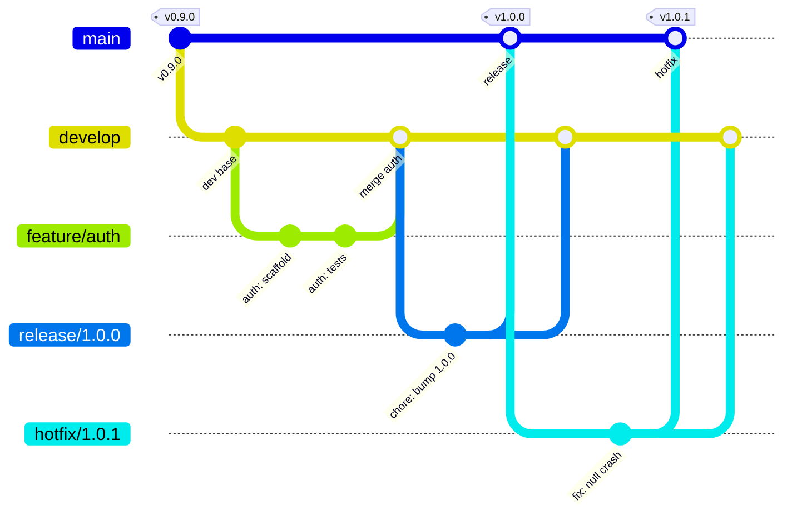
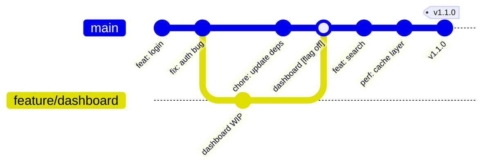
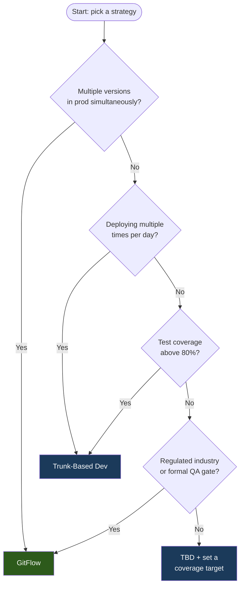
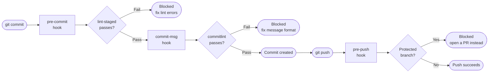
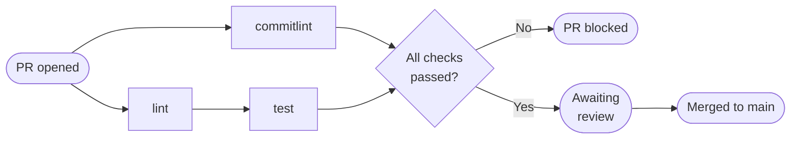

> **30 Days of DevOps** — a series by [@syssignals](https://x.com/syssignals)
> Every article is a working project. Every command is verified. No fluff.

## The problem nobody talks about

Your CI/CD pipeline is fast. Your tests pass. Your Dockerfiles are clean.

But every deployment is still a negotiation. Developers are stepping on each other. Hotfixes break features. The `main` branch is a graveyard of half-merged work and nobody quite knows what's in prod.

The bottleneck isn't your tools. It's your branching strategy.

Most teams inherit a branching strategy by accident — someone set it up years ago, nobody questioned it, and now it's load-bearing. Changing it feels risky, so nobody does.

This article gives you two battle-tested strategies — GitFlow and Trunk-Based Development — with complete setup, real configs, and the decision framework to know which one fits your team. By the end, you'll have a production-ready repository template with enforced workflow, automated hooks, and PR automation you can use immediately.

---

## What you'll build

A fully configured Git repository with:

- Branch protection rules enforced via GitHub API
- Husky + lint-staged pre-commit hooks (lint, format, commit message validation)
- Conventional Commits enforcement with commitlint
- PR template with checklist
- GitFlow and Trunk-Based branch models implemented side by side
- A reusable `repo-template/` folder you can `git clone` into any new project

**Estimated time:** 45 minutes  
**Skill level:** Beginner to intermediate  
**All commands tested on:** Ubuntu 22.04, macOS 14 Sonoma, Git 2.43+

---

## Prerequisites

- Git 2.30+ installed (`git --version`)
- Node.js 18+ installed (`node --version`) — needed for Husky and commitlint
- A GitHub account with a personal access token (classic) scoped to `repo`
- `gh` CLI installed (optional but recommended — install: https://cli.github.com)
- `jq` installed (`sudo apt install jq` / `brew install jq`)

---

## Part 1: Understanding the two strategies

Before touching a terminal, you need to understand what you're choosing between and why it matters for DevOps.

### GitFlow

Introduced by Vincent Driessen in 2010. Designed for teams with scheduled releases and multiple versions in production simultaneously.

**Branch structure:**

```
main          ← production code only. Tagged at every release.
develop       ← integration branch. All features merge here.
feature/*     ← one branch per feature. Branches off develop.
release/*     ← release stabilization. Branches off develop.
hotfix/*      ← emergency fixes. Branches off main.
```



**Lifecycle of a feature:**

```bash
git checkout develop
git checkout -b feature/user-authentication
# ... work ...
git checkout develop
git merge --no-ff feature/user-authentication
git branch -d feature/user-authentication
```

**Lifecycle of a release:**

```bash
git checkout develop
git checkout -b release/1.4.0
# ... bug fixes and version bumps only ...
git checkout main
git merge --no-ff release/1.4.0
git tag -a v1.4.0 -m "Release 1.4.0"
git checkout develop
git merge --no-ff release/1.4.0
git branch -d release/1.4.0
```

**When GitFlow works:**
- Mobile apps with App Store review cycles
- SaaS products with enterprise clients on specific versions
- Teams with QA cycles that require a code freeze period
- Regulated industries with formal release gates

**When GitFlow fails:**
- Continuous deployment pipelines (release branches block CD)
- Small teams (overhead kills velocity)
- Microservices (coordination across repos becomes impossible)

---

### Trunk-Based Development (TBD)

The model used by Google, Meta, Netflix, and most high-performing DevOps teams. All developers commit directly to `main` (the "trunk") or use very short-lived feature branches (< 2 days).

**Branch structure:**

```
main          ← the trunk. Always deployable. CI runs on every commit.
feature/*     ← optional. Max lifetime: 2 days. Merged via PR.
```



**The key practices that make TBD work:**

1. **Feature flags** — incomplete features are deployed but hidden behind a flag
2. **Branch by abstraction** — large refactors use an abstraction layer, not a long-lived branch
3. **Pair programming** — reduces the need for long review cycles
4. **Comprehensive CI** — every commit triggers full test suite
5. **Small commits** — changes that can be reviewed in under 10 minutes

**When TBD works:**
- Continuous deployment (deploy multiple times per day)
- Teams with high test coverage (>80%)
- Microservices with independent deployment
- Teams with strong DevOps culture (shared ownership of main)

**When TBD fails:**
- Low test coverage (broken main blocks everyone)
- Large distributed teams without feature flag infrastructure
- Compliance requirements that mandate release gates

---

### Which one should you choose?



---

## Part 2: Set up the repository

### Step 1: Initialize the repository

```bash
# Create project directory
mkdir devops-git-template && cd devops-git-template

# Initialize git
git init
git checkout -b main

# Create base structure
mkdir -p .github/workflows .github/ISSUE_TEMPLATE src tests scripts
touch README.md .gitignore .env.example
```

Create a solid `.gitignore` that covers most DevOps projects:

```bash
cat > .gitignore << 'EOF'
# Environment and secrets
.env
.env.local
.env.*.local
*.pem
*.key
*.p12
*.pfx

# Node
node_modules/
npm-debug.log*
yarn-debug.log*
yarn-error.log*
dist/
build/
.npm

# Python
__pycache__/
*.py[cod]
*$py.class
*.egg-info/
.venv/
venv/
.pytest_cache/

# Terraform
.terraform/
*.tfstate
*.tfstate.*
*.tfvars
!*.tfvars.example
.terraform.lock.hcl

# Docker
.dockerignore

# IDE
.vscode/
.idea/
*.swp
*.swo
.DS_Store
Thumbs.db

# Build artifacts
*.log
*.tmp
*.bak
coverage/
.nyc_output/
EOF
```

### Step 2: Initialize Node.js for tooling

```bash
npm init -y
```

### Step 3: Install and configure Husky

Husky intercepts Git hooks and lets you run scripts before commits and pushes.

```bash
# Install Husky and lint-staged
npm install --save-dev husky lint-staged

# Initialize Husky (creates .husky/ directory)
npx husky init

# Verify .husky/ was created
ls -la .husky/
```

Expected output:
```
total 16
drwxr-xr-x  3 user user 4096 Jan 15 10:23 .
drwxr-xr-x 12 user user 4096 Jan 15 10:23 ..
-rwxr-xr-x  1 user user   29 Jan 15 10:23 pre-commit
```

### Step 4: Install and configure commitlint

commitlint enforces the [Conventional Commits](https://www.conventionalcommits.org/) specification. This gives you a machine-readable commit history that tools like `semantic-release` and changelog generators can parse.

```bash
npm install --save-dev @commitlint/cli @commitlint/config-conventional
```

Create the commitlint config:

```bash
cat > commitlint.config.js << 'EOF'
module.exports = {
  extends: ['@commitlint/config-conventional'],
  rules: {
    // Type must be one of the following
    'type-enum': [
      2,
      'always',
      [
        'feat',     // New feature
        'fix',      // Bug fix
        'docs',     // Documentation only
        'style',    // Formatting, no logic change
        'refactor', // Code change that is neither fix nor feature
        'perf',     // Performance improvement
        'test',     // Adding or correcting tests
        'build',    // Build system or dependencies
        'ci',       // CI/CD configuration
        'chore',    // Maintenance tasks
        'revert',   // Reverts a previous commit
        'hotfix',   // Emergency fix (GitFlow specific)
        'release',  // Release commit
      ],
    ],
    // Subject line max length
    'subject-max-length': [2, 'always', 100],
    // Subject must not end with a period
    'subject-full-stop': [2, 'never', '.'],
    // Body must have blank line before it
    'body-leading-blank': [2, 'always'],
    // Footer must have blank line before it
    'footer-leading-blank': [2, 'always'],
  },
};
EOF
```

Add the commit-msg hook:

```bash
cat > .husky/commit-msg << 'EOF'
#!/bin/sh
npx --no -- commitlint --edit "$1"
EOF

chmod +x .husky/commit-msg
```

### Step 5: Install and configure ESLint + Prettier

```bash
npm install --save-dev eslint prettier eslint-config-prettier

# Create ESLint config
cat > .eslintrc.js << 'EOF'
module.exports = {
  env: {
    node: true,
    es2021: true,
  },
  extends: ['eslint:recommended', 'prettier'],
  parserOptions: {
    ecmaVersion: 'latest',
    sourceType: 'module',
  },
  rules: {
    'no-console': 'warn',
    'no-unused-vars': ['error', { argsIgnorePattern: '^_' }],
    'no-var': 'error',
    'prefer-const': 'error',
  },
};
EOF

# Create Prettier config
cat > .prettierrc << 'EOF'
{
  "semi": true,
  "trailingComma": "es5",
  "singleQuote": true,
  "printWidth": 100,
  "tabWidth": 2,
  "useTabs": false
}
EOF
```

### Step 6: Configure lint-staged

lint-staged runs linters only on staged files — not the entire codebase. This makes pre-commit hooks fast enough that developers won't disable them.

Add to `package.json`:

```bash
node -e "
const fs = require('fs');
const pkg = JSON.parse(fs.readFileSync('package.json', 'utf8'));
pkg['lint-staged'] = {
  '*.{js,ts,jsx,tsx}': ['eslint --fix', 'prettier --write'],
  '*.{json,md,yml,yaml}': ['prettier --write'],
  '*.sh': ['shellcheck']
};
pkg.scripts = {
  ...pkg.scripts,
  'prepare': 'husky',
  'lint': 'eslint . --ext .js,.ts',
  'lint:fix': 'eslint . --ext .js,.ts --fix',
  'format': 'prettier --write .',
  'format:check': 'prettier --check .'
};
fs.writeFileSync('package.json', JSON.stringify(pkg, null, 2));
console.log('package.json updated');
"
```

Update the pre-commit hook:

```bash
cat > .husky/pre-commit << 'EOF'
#!/bin/sh
npx lint-staged
EOF

chmod +x .husky/pre-commit
```

Here's what happens on every `git commit` with this setup:



### Step 7: Create the PR template

```bash
mkdir -p .github

cat > .github/pull_request_template.md << 'EOF'
## Summary

<!-- What does this PR do? One paragraph max. -->

## Type of change

- [ ] `feat` — New feature
- [ ] `fix` — Bug fix
- [ ] `docs` — Documentation update
- [ ] `refactor` — Code refactor (no functional change)
- [ ] `ci` — CI/CD changes
- [ ] `chore` — Maintenance
- [ ] `hotfix` — Emergency production fix

## Related issues

Closes #<!-- issue number -->

## How to test

<!-- Step-by-step instructions for reviewers to test this change -->

1. 
2. 
3. 

## Checklist

- [ ] My code follows the project's style guidelines
- [ ] I have run `npm run lint` and there are no errors
- [ ] I have added or updated tests
- [ ] I have updated documentation if needed
- [ ] My commits follow the Conventional Commits format
- [ ] I have checked this branch is up to date with the target branch
- [ ] This PR is < 400 lines of change (if not, explain why)

## Screenshots / output (if applicable)

<!-- Paste terminal output or screenshots here -->

## Notes for reviewers

<!-- Anything the reviewer should pay special attention to -->
EOF
```

### Step 8: Create GitHub Actions CI workflow

```bash
cat > .github/workflows/ci.yml << 'EOF'
name: CI

on:
  push:
    branches: [main, develop]
  pull_request:
    branches: [main, develop]

concurrency:
  group: ${{ github.workflow }}-${{ github.ref }}
  cancel-in-progress: true

jobs:
  lint:
    name: Lint & Format
    runs-on: ubuntu-22.04
    steps:
      - name: Checkout
        uses: actions/checkout@v4

      - name: Setup Node.js
        uses: actions/setup-node@v4
        with:
          node-version: '20'
          cache: 'npm'

      - name: Install dependencies
        run: npm ci

      - name: Run ESLint
        run: npm run lint

      - name: Check formatting
        run: npm run format:check

  commitlint:
    name: Validate commit messages
    runs-on: ubuntu-22.04
    if: github.event_name == 'pull_request'
    steps:
      - name: Checkout
        uses: actions/checkout@v4
        with:
          fetch-depth: 0

      - name: Setup Node.js
        uses: actions/setup-node@v4
        with:
          node-version: '20'
          cache: 'npm'

      - name: Install dependencies
        run: npm ci

      - name: Validate PR commits
        run: |
          npx commitlint \
            --from ${{ github.event.pull_request.base.sha }} \
            --to ${{ github.event.pull_request.head.sha }} \
            --verbose

  test:
    name: Tests
    runs-on: ubuntu-22.04
    needs: lint
    steps:
      - name: Checkout
        uses: actions/checkout@v4

      - name: Setup Node.js
        uses: actions/setup-node@v4
        with:
          node-version: '20'
          cache: 'npm'

      - name: Install dependencies
        run: npm ci

      - name: Run tests
        run: npm test --if-present
EOF
```

Every PR triggers this pipeline before anyone can merge:



---

## Part 3: Set up GitFlow on a real repository

### Step 1: Install git-flow

```bash
# Ubuntu / Debian
sudo apt-get install git-flow -y

# macOS
brew install git-flow-avh

# Verify
git flow version
```

Expected output:
```
1.12.3 (AVH Edition)
```

### Step 2: Initialize git-flow

```bash
# Run inside your repo directory
git flow init -d
```

The `-d` flag accepts all defaults. This creates and configures:

```
Branch name for production releases: main
Branch name for "next release" development: develop
Feature branches: feature/
Bugfix branches: bugfix/
Release branches: release/
Hotfix branches: hotfix/
Support branches: support/
Version tag prefix: v
```

Verify both branches exist:

```bash
git branch -a
```

Expected output:
```
* develop
  main
```

### Step 3: Work through the full GitFlow lifecycle

**Create and finish a feature:**

```bash
# Start a feature
git flow feature start user-authentication

# You are now on branch: feature/user-authentication
# Verify
git branch --show-current
```

Expected output:
```
feature/user-authentication
```

```bash
# Simulate some work
mkdir -p src/auth
cat > src/auth/index.js << 'EOF'
const authenticate = (username, password) => {
  // Authentication logic would go here
  return { user: username, token: 'jwt-token-placeholder' };
};

module.exports = { authenticate };
EOF

# Stage and commit with conventional commit format
git add src/auth/index.js
git commit -m "feat(auth): add authentication module scaffold"

# Finish the feature — merges to develop with --no-ff
git flow feature finish user-authentication
```

Expected output:
```
Branches 'develop' and 'feature/user-authentication' have diverged.
Updating 9f3e2a1..c4b8d2f
Fast-forward (no commit created; -m option ignored)
 src/auth/index.js | 6 ++++++
 1 file changed, 6 insertions(+)
Deleted branch feature/user-authentication (was c4b8d2f).

Summary of actions:
- The feature branch 'feature/user-authentication' was merged into 'develop'
- Feature branch 'feature/user-authentication' has been locally deleted
- You are now on branch 'develop'
```

**Create and finish a release:**

```bash
# Start a release from develop
git flow release start 1.0.0

# Bump version in package.json
npm version 1.0.0 --no-git-tag-version

git add package.json
git commit -m "release: bump version to 1.0.0"

# Finish the release
# This: merges to main, tags v1.0.0, merges back to develop
git flow release finish '1.0.0'
```

You'll be prompted for a tag message. Enter: `Release v1.0.0`

Verify the tag was created:

```bash
git tag -l
```

Expected output:
```
v1.0.0
```

**Simulate a hotfix:**

```bash
# Start hotfix from main
git flow hotfix start 1.0.1

cat >> src/auth/index.js << 'EOF'

// Hotfix: prevent null username crash
const safeAuthenticate = (username, password) => {
  if (!username || !password) throw new Error('Credentials required');
  return authenticate(username, password);
};

module.exports = { authenticate, safeAuthenticate };
EOF

git add src/auth/index.js
git commit -m "fix(auth): prevent null username crash in authenticate"

# Finish hotfix — merges to main AND develop
git flow hotfix finish '1.0.1'
```

---

## Part 4: Set up Trunk-Based Development

TBD requires discipline more than tooling. The tooling enforces the discipline.

### Step 1: Protect the main branch

If you're using the `gh` CLI:

```bash
# Set your repo name
REPO="your-github-username/devops-git-template"

gh api \
  --method PUT \
  -H "Accept: application/vnd.github+json" \
  /repos/${REPO}/branches/main/protection \
  --input - << 'EOF'
{
  "required_status_checks": {
    "strict": true,
    "contexts": ["lint", "test", "commitlint"]
  },
  "enforce_admins": true,
  "required_pull_request_reviews": {
    "required_approving_review_count": 1,
    "dismiss_stale_reviews": true,
    "require_code_owner_reviews": false
  },
  "restrictions": null,
  "allow_force_pushes": false,
  "allow_deletions": false,
  "required_linear_history": true
}
EOF
```

Expected output:
```json
{
  "url": "https://api.github.com/repos/your-username/devops-git-template/branches/main/protection",
  "required_status_checks": {
    "strict": true,
    ...
  }
}
```

What each rule does:

| Rule | What it enforces |
|---|---|
| `required_status_checks` | CI must pass before merge |
| `strict: true` | Branch must be up to date with main before merge |
| `enforce_admins: true` | Rules apply to repo admins too — no exceptions |
| `required_approving_review_count: 1` | At least 1 human approval required |
| `dismiss_stale_reviews: true` | New commits invalidate previous approvals |
| `allow_force_pushes: false` | Nobody can rewrite main history |
| `required_linear_history: true` | Enforces squash or rebase merges — no merge commits |

### Step 2: Create a CODEOWNERS file

CODEOWNERS automatically assigns reviewers based on which files are changed.

```bash
cat > .github/CODEOWNERS << 'EOF'
# Global owners — review everything
*                   @your-github-username

# CI/CD changes require DevOps team review
.github/            @your-github-username
*.yml               @your-github-username
Dockerfile*         @your-github-username
terraform/          @your-github-username

# Auth module — security-sensitive
src/auth/           @your-github-username
EOF
```

### Step 3: Feature flag scaffold for TBD

In Trunk-Based Development, you merge incomplete features to main behind a feature flag. Here's a minimal implementation:

```bash
cat > src/feature-flags.js << 'EOF'
/**
 * Feature flag system for Trunk-Based Development
 * Flags are read from environment variables.
 * In production, use a service like LaunchDarkly, Flagsmith, or Unleash.
 */

const flags = {
  // Format: FEATURE_FLAG_<NAME>=true|false
  NEW_DASHBOARD: process.env.FEATURE_FLAG_NEW_DASHBOARD === 'true',
  BETA_SEARCH: process.env.FEATURE_FLAG_BETA_SEARCH === 'true',
  USER_AUTHENTICATION_V2: process.env.FEATURE_FLAG_USER_AUTH_V2 === 'true',
};

const isEnabled = (flagName) => {
  if (!(flagName in flags)) {
    console.warn(`[FeatureFlag] Unknown flag: ${flagName}`);
    return false;
  }
  return flags[flagName];
};

module.exports = { isEnabled, flags };
EOF
```

Example usage in application code:

```javascript
const { isEnabled } = require('./feature-flags');

const getAuthHandler = () => {
  if (isEnabled('USER_AUTHENTICATION_V2')) {
    return require('./auth/v2');  // New implementation, hidden behind flag
  }
  return require('./auth/v1');    // Stable implementation
};
```

### Step 4: Add a pre-push hook to block direct pushes to main

```bash
cat > .husky/pre-push << 'EOF'
#!/bin/sh

CURRENT_BRANCH=$(git symbolic-ref HEAD | sed -e 's,.*/\(.*\),\1,')
PROTECTED_BRANCHES="^(main|master|develop)$"

if echo "$CURRENT_BRANCH" | grep -qE "$PROTECTED_BRANCHES"; then
  echo "⛔ Direct push to '$CURRENT_BRANCH' is not allowed."
  echo "   Create a feature branch and open a pull request."
  echo ""
  echo "   git checkout -b feature/your-feature-name"
  exit 1
fi

exit 0
EOF

chmod +x .husky/pre-push
```

Test it:

```bash
# Should be blocked if you're on main
git push origin main
```

Expected output:
```
⛔ Direct push to 'main' is not allowed.
   Create a feature branch and open a pull request.

   git checkout -b feature/your-feature-name
error: failed to push some refs to 'origin'
```

---

## Part 5: The reusable template

Package everything into a template structure others can use:

```bash
# Create the template structure
mkdir -p repo-template/.github/workflows
mkdir -p repo-template/.husky
mkdir -p repo-template/src

# Copy all config files
cp .gitignore repo-template/
cp .eslintrc.js repo-template/
cp .prettierrc repo-template/
cp commitlint.config.js repo-template/
cp package.json repo-template/
cp .github/pull_request_template.md repo-template/.github/
cp .github/CODEOWNERS repo-template/.github/
cp .github/workflows/ci.yml repo-template/.github/workflows/
cp .husky/pre-commit repo-template/.husky/
cp .husky/pre-push repo-template/.husky/
cp .husky/commit-msg repo-template/.husky/
cp src/feature-flags.js repo-template/src/

# Create a setup script so others can bootstrap quickly
cat > repo-template/setup.sh << 'EOF'
#!/bin/bash
set -euo pipefail

echo "Setting up repository from syssignals DevOps template..."

# Install dependencies
npm install

# Initialize Husky
npm run prepare

# Verify hooks are executable
chmod +x .husky/pre-commit .husky/pre-push .husky/commit-msg

echo "Setup complete."
echo ""
echo "Next steps:"
echo "  1. Update CODEOWNERS with your GitHub username"
echo "  2. Set branch protection rules on GitHub (see README)"
echo "  3. Run 'npm run lint' to verify ESLint is working"
echo "  4. Make your first commit: git commit -m 'chore: initial repository setup'"
EOF

chmod +x repo-template/setup.sh
```

---

## How it works under the hood

**Why Husky intercepts hooks:**

Git stores hooks in `.git/hooks/` — a directory that is never committed or shared. Husky solves this by adding a `prepare` npm script that installs scripts into `.git/hooks/` when anyone runs `npm install`. The hooks in `.husky/` are committed to the repo and become the source of truth. When a developer clones the repo and runs `npm install`, Husky automatically installs the hooks.

**Why lint-staged and not full linting:**

Running ESLint on your entire codebase before every commit is slow. On a large project it can take 30+ seconds. Developers start using `git commit --no-verify` to skip it. lint-staged runs linters only on the files you've staged with `git add` — typically 1–5 files. The hook completes in under 2 seconds, which developers will actually tolerate.

**Why conventional commits matter for DevOps:**

Conventional commits aren't just a style guide. Tools like `semantic-release` parse commit messages to determine the next version number (feat = minor bump, fix = patch bump, BREAKING CHANGE = major bump), auto-generate changelogs, and publish packages — all automatically in CI. Enforcing the format from day one means you can adopt these tools later without reformatting history.

**Why `--no-ff` in GitFlow:**

The `--no-ff` flag (no fast-forward) forces Git to create a merge commit even when the history is linear. Without it, Git can fast-forward the branch pointer and you lose the context that these commits belonged to a feature branch. With `--no-ff`, the graph always shows which commits were part of which feature — invaluable for `git bisect` and debugging.

---

## Common errors and fixes

### Error 1: `husky: command not found`

```
.husky/pre-commit: line 1: husky: command not found
```

**Cause:** Husky wasn't installed or `npm install` wasn't run after cloning.

**Fix:**
```bash
npm install
npm run prepare
```

---

### Error 2: `commitlint` fails with `Your commit message has an error`

```
✖   subject may not be empty [subject-empty]
✖   type may not be empty [type-empty]
```

**Cause:** Commit message doesn't follow Conventional Commits format.

**Fix:** Use the correct format:
```bash
# Wrong
git commit -m "added login feature"

# Correct
git commit -m "feat(auth): add login form with JWT support"
```

---

### Error 3: `git flow` command not found after install

```
git: 'flow' is not a git command
```

**Cause:** On some systems `git-flow` installs as a separate binary not recognized by git.

**Fix:**
```bash
# Ubuntu: install the AVH edition explicitly
sudo apt-get remove git-flow
sudo apt-get install git-flow -y

# macOS: use Homebrew AVH edition
brew uninstall git-flow
brew install git-flow-avh

# Verify
which git-flow
git flow version
```

---

### Error 4: Branch protection API returns 403

```
{
  "message": "Not Found",
  "documentation_url": "..."
}
```

**Cause:** Your GitHub token doesn't have `repo` scope, or the repo is private and the token lacks access.

**Fix:**
```bash
# Verify your token has the right scopes
gh auth status

# Re-authenticate with correct scopes
gh auth login --scopes repo,workflow
```

---

### Error 5: `lint-staged` fails with `No staged files match`

```
✔ Preparing lint-staged...
✔ Running tasks for staged files...
✔ Applying modifications from tasks...
✔ Cleaning up temporary files...
```

This is actually **not** an error — it means lint-staged ran but found no matching files in your staged changes. If you staged a `.sh` file and configured `shellcheck`, but `shellcheck` isn't installed, you'll see:

```bash
# Install shellcheck
sudo apt-get install shellcheck   # Ubuntu
brew install shellcheck           # macOS
```

---

## What's next — extend this project

**Make it production-ready:**

1. Add `semantic-release` to automate version bumps and changelog generation from your conventional commits. Configure it in `.releaserc.json` and add a `release` job to your CI workflow.

2. Add `danger` for automated PR review — it can enforce PR size limits, check that tests were added with features, and post comments when the PR template isn't filled out.

3. Integrate `git-secrets` (AWS) or `gitleaks` to scan commits for accidentally committed secrets before they reach GitHub.

---

## Series recap — Day 1

You now have:

- A Git repository with enforced workflow (pre-commit, pre-push, commit-msg hooks)
- Conventional Commits enforced at the hook level and validated in CI
- A PR template that enforces review discipline
- Branch protection rules that make it physically impossible to push broken code to main
- A complete understanding of when to use GitFlow vs Trunk-Based Development
- A reusable `repo-template/` folder you can drop into any project

The foundation is set. Everything built in the next 29 articles will use this repository structure.

---

## Day 2 preview

**Day 2: Dockerize any application the right way — multi-stage builds and best practices**

We'll take a Node.js application from a 1.2GB naive image to a 45MB hardened production image. Multi-stage builds, non-root users, BuildKit cache mounts, and Docker Scout vulnerability scanning.

---

*This is Day 1 of the [30 Days of DevOps](https://x.com/syssignals) series.*  
*Follow [@syssignals](https://x.com/syssignals) on X — Day 2 drops tomorrow.*

*Found an error? Drop a reply on X and I'll fix it and credit you.*
