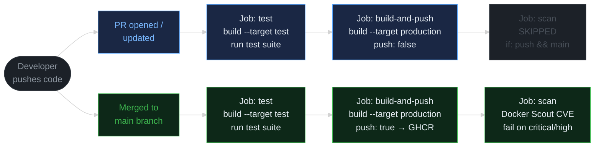
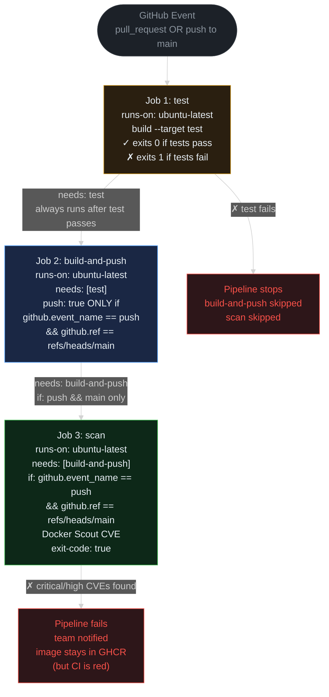
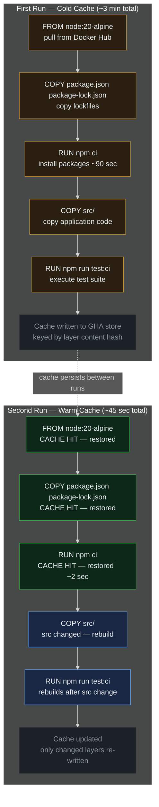
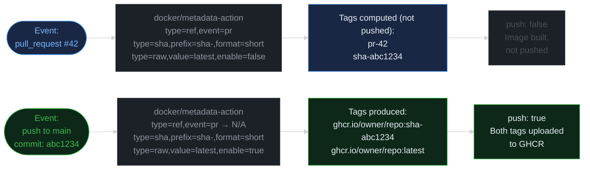

> **30 Days of DevOps** — a series by [@syssignals](https://x.com/syssignals)
> Every article is a working project. Every command is verified. No fluff.

---

## The problem with manual Docker workflows

Your Dockerfile is perfect. The multi-stage build you wrote in Day 2 produces a 47 MB distroless image. The Compose stack from Day 3 runs cleanly. Everything works.

Until someone on your team runs `docker build -t myapp:latest . && docker push` from their laptop — without running the tests, without scanning for CVEs, without tagging the image with anything more useful than `latest` — and pushes directly to the registry on a Friday afternoon.

Three weeks later, a CVE advisory lands in your inbox. The image in production has a critical vulnerability in a package that was patched two months ago. Nobody noticed because the build that shipped it never ran a scanner. Nobody caught the regression in the health endpoint because nobody ran the test suite.

The bad path was too easy. The fix is making the bad path impossible.

A CI/CD pipeline does one thing: it removes humans from the build, test, and publish loop. The only way to get a new image into the registry is to push code, pass tests, and survive a CVE scan. There is no other path.

This article builds that pipeline. You'll have a 3-job GitHub Actions workflow that runs in under 2 minutes, uses Docker's layer cache to make repeat builds nearly instant, and produces signed, tagged images in GHCR on every merge to main.

---

## What you'll build

A production-grade GitHub Actions pipeline with three jobs and smart trigger logic:

- **Trigger logic**: `pull_request` to main runs test + build (no push, no scan). `push` to main runs all three jobs including push to GHCR and CVE scan.
- **Job 1 `test`**: checkout → setup Buildx → build `--target test` stage (runs the full test suite inside Docker, same environment as production)
- **Job 2 `build-and-push`**: needs test → login to GHCR → docker/metadata-action for tags → build `--target production` → push only on main merge
- **Job 3 `scan`**: needs build-and-push → Docker Scout CVE scan → fail pipeline if critical or high CVEs are found
- **GitHub Actions layer cache** (`type=gha`) so repeated builds restore from cache in under 45 seconds
- **Concurrency group** with `cancel-in-progress: true` to stop wasting CI minutes on stale PR runs

**Estimated time:** 45 minutes

---

## Architecture diagrams

### Diagram 1 — Pipeline trigger flow



**Reading this diagram:**

Start at **"Developer pushes code"** on the left. Every push takes one of two paths depending on the Git event type.

The **blue (top) path** is a pull request — either newly opened or updated with a new commit. The `pull_request` trigger fires. Both `test` and `build-and-push` run, but notice that `build-and-push` has `push: false` — the image is built and verified, but never uploaded to the registry. The `scan` job is greyed out and skipped entirely; the `if:` condition evaluates to false because this is not a push to main.

The **green (bottom) path** is what happens after a PR is approved and merged. GitHub fires a `push` event on the `main` branch. All three jobs run in sequence. `build-and-push` now has `push: true` — the production image is uploaded to GHCR with proper tags. The `scan` job runs against the freshly pushed image, querying Docker Scout's vulnerability database. If critical or high CVEs are found, the pipeline fails and the team is notified.

The key insight: PRs never publish images. Only a merge to main, after passing tests, can put an image into the registry. The bad path requires physically merging broken code — and even then the CVE scan has one more chance to catch it.

---

### Diagram 2 — Job dependency graph



**Reading this diagram:**

The **"GitHub Event"** node at the top represents any workflow trigger — it does not matter whether it is a PR or a push to main. The job graph is the same shape regardless; what changes is behaviour at runtime.

**Job 1 (test)** shown in yellow is the entry gate. It builds the `test` stage of the Dockerfile. The test stage contains `RUN npm run test:ci --if-present` — a `RUN` instruction that executes during the build itself, not at runtime. If tests fail, the build exits non-zero, and the job fails. There is no separate `npm test` step that someone could comment out — the test execution is structurally baked into the Docker build graph. If this job fails, the red "Pipeline stops" node fires and nothing else runs.

**Job 2 (build-and-push)** shown in blue declares `needs: [test]`, so it only starts after test passes. The critical condition is inline in the `push:` parameter: `${{ github.event_name == 'push' && github.ref == 'refs/heads/main' }}`. On a PR this evaluates to `false` — the image is built but not uploaded. On a merge to main it evaluates to `true` — the image is uploaded to GHCR with tags.

**Job 3 (scan)** shown in green has a top-level `if:` condition that prevents it from even starting on PRs. It only runs when both conditions are true: the event is a `push` AND the ref is `refs/heads/main`. This is intentional — scanning a PR build that was never pushed to the registry would fail because there is nothing to pull.

---

### Diagram 3 — Docker layer cache with GHA



**Reading this diagram:**

This diagram shows the same 5-layer build across two sequential workflow runs. The layer order matches a real Dockerfile: base image, then package files, then `npm ci`, then application source, then the test execution.

**Top box (cold cache, ~3 minutes):** Every layer must be computed from scratch. The most expensive step is `RUN npm ci`, which downloads and installs roughly 450 npm packages from the internet. This alone takes 60–90 seconds on a standard GitHub Actions runner. At the end of the run, BuildKit serialises the layer cache and writes it to the GitHub Actions cache store. Each layer is keyed by a hash of its inputs — the instruction text plus the content of any files copied in.

**Bottom box (warm cache, ~45 seconds):** A developer pushes a change to `src/`. The first three layers (base image, package files, `npm ci`) have inputs that did not change — their cache keys are identical. BuildKit restores them from the GHA cache store in a few seconds instead of rebuilding them. The fourth layer (`COPY src/ .`) has new content, so its cache key changes and it must rebuild. Everything after it in the chain also rebuilds, including the test run. The total wall-clock time drops from ~3 minutes to ~45 seconds.

The rule to remember: **changing `package.json` or `package-lock.json` busts the `npm ci` cache**. That is the correct behaviour — if your dependencies changed, you must reinstall them. If you only change application code in `src/`, the `npm ci` layer is reused and you get the fast path.

---

### Diagram 4 — GHCR tagging strategy



**Reading this diagram:**

`docker/metadata-action` is a GitHub Actions action that automatically computes image tags based on the current Git event. You declare rules; it produces the final tag list. The diagram shows what tags are produced under each event type.

**PR #42 path (blue, top):** The action fires with three tag rules. `type=ref,event=pr` produces `pr-42` — a human-readable tag that identifies the PR. `type=sha` produces `sha-abc1234` — a precise, immutable reference to the exact commit being tested. The `type=raw,value=latest` rule has `enable=false` because `github.ref` is not `refs/heads/main`. Since `push: false`, these tags are computed but the image is never actually uploaded. Tags are meaningless without a push — they serve as a dry-run confirmation that the metadata logic is correct.

**Main merge path (green, bottom):** The `type=ref,event=pr` rule no longer applies (this is not a PR event). `type=sha` produces the same commit-SHA tag format. `type=raw,value=latest` now has `enable=true` because the ref is `refs/heads/main`. Both tags are uploaded to GHCR. This means every main merge produces two tags: one immutable (`sha-abc1234`) and one floating (`latest`).

Why two tags? `latest` is convenient for human use — `docker pull ghcr.io/owner/repo:latest` always gives you the most recent release. But in production manifests, Kubernetes deployments, or `docker-compose.yml`, you should always pin to the SHA tag. `latest` can change under you; `sha-abc1234` never will.

---

## Prerequisites

### 1. GitHub account and repository

You need a GitHub account and the `docker-best-practices/` project from Days 2 and 3 pushed to a public repository. Run the following commands from inside the project directory:

```bash
cd docker-best-practices
git init
git add .
git commit -m "chore: initial commit — day 2/3 project"
gh repo create docker-best-practices --public --source=. --push
```

Expected output:

```
✓ Created repository yourname/docker-best-practices on GitHub
  https://github.com/yourname/docker-best-practices
✓ Added remote origin
✓ Pushed commits to remote
```

Verify the repository is visible:

```bash
gh repo view --web
# Opens https://github.com/yourname/docker-best-practices in your browser
```

### 2. Docker Hub account (for Docker Scout)

Docker Scout — Docker's official CVE scanning tool — requires Docker Hub credentials even when scanning images stored in GHCR. This is because Scout's vulnerability database is hosted on Docker Hub infrastructure.

Create a read-only personal access token at [hub.docker.com/settings/security](https://hub.docker.com/settings/security):

1. Click **New Access Token**
2. Description: `github-actions-scout`
3. Access permissions: **Read-only**
4. Copy the token — it begins with `dckr_pat_`

You do not need Docker Hub to store images. GHCR handles image storage. You only need Docker Hub credentials so Scout can authenticate against its vulnerability database.

### 3. GitHub secrets to configure

The pipeline uses three credentials:

| Secret | Source | Notes |
|---|---|---|
| `GITHUB_TOKEN` | Automatic | GitHub injects this into every workflow run. No setup needed. Used for GHCR login and package writes. |
| `DOCKERHUB_USERNAME` | Manual | Your Docker Hub username (not email). |
| `DOCKERHUB_TOKEN` | Manual | The `dckr_pat_` token you created above. |

Add the manual secrets via the `gh` CLI:

```bash
gh secret set DOCKERHUB_USERNAME --body "yourdockerhubusername"
gh secret set DOCKERHUB_TOKEN --body "dckr_pat_xxxxxxxxxxxxxxxxxxxx"
```

Expected output for each:

```
✓ Set secret DOCKERHUB_USERNAME for yourname/docker-best-practices
✓ Set secret DOCKERHUB_TOKEN for yourname/docker-best-practices
```

Verify secrets are registered (values are hidden):

```bash
gh secret list
# NAME                  UPDATED
# DOCKERHUB_TOKEN       2026-05-15
# DOCKERHUB_USERNAME    2026-05-15
```

### 4. Software check

Verify everything needed is installed and working before proceeding:

```bash
echo "=== gh CLI ===" && gh --version && \
echo "=== Docker ===" && docker --version && \
echo "=== git ===" && git --version && \
echo "" && echo "All prerequisites met."
```

Expected output:

```
=== gh CLI ===
gh version 2.49.2 (2026-04-01)
https://github.com/cli/cli/releases/tag/v2.49.2
=== Docker ===
Docker version 27.3.1, build ce12230
=== git ===
git version 2.45.2

All prerequisites met.
```

If `gh` is missing: [cli.github.com](https://cli.github.com). If Docker is missing: [docs.docker.com/get-docker](https://docs.docker.com/get-docker).

---

## Part 1: Repository setup

### Verify the remote is configured

If you already pushed the project in the Prerequisites section, confirm the remote is correct:

```bash
git remote -v
# origin  https://github.com/yourname/docker-best-practices.git (fetch)
# origin  https://github.com/yourname/docker-best-practices.git (push)
```

If `origin` is missing, add it:

```bash
git remote add origin https://github.com/yourname/docker-best-practices.git
git push -u origin main
```

### Confirm the Dockerfile has the required stages

The pipeline depends on two specific stage names: `test` and `production`. Verify they exist:

```bash
grep "^FROM\|^# ──" docker-best-practices/Dockerfile
```

You should see output like:

```
FROM node:20-alpine AS deps
FROM node:20-alpine AS dev
FROM node:20-alpine AS test
FROM gcr.io/distroless/nodejs20-debian12 AS production
```

If your stage names differ, either update the Dockerfile or adjust the `--target` values in the workflow. The workflow assumes exact names `test` and `production`.

### Understanding GHCR

GHCR (GitHub Container Registry) is GitHub's native container registry, available at `ghcr.io`. Key facts:

- **Authentication**: The `GITHUB_TOKEN` that GitHub automatically injects into every workflow run can authenticate against GHCR. No separate token setup is needed.
- **Permissions**: The workflow job must declare `permissions: packages: write`. Without this declaration, the `GITHUB_TOKEN` only has read access to packages, and the push will fail with a 403.
- **Image location**: Images are stored at `ghcr.io/OWNER/REPO`. For a repository at `github.com/yourname/docker-best-practices`, the image is `ghcr.io/yourname/docker-best-practices`.
- **Visibility**: After the first push, the package appears under your GitHub profile at `github.com/yourname?tab=packages`. By default it is private — you can make it public in the package settings if you want the image to be `docker pull`-able without authentication.

---

## Part 2: The workflow file

Create the workflow directory and file:

```bash
mkdir -p docker-best-practices/.github/workflows
```

Create `.github/workflows/ci.yml` with the following content:

```yaml
name: CI

on:
  pull_request:
    branches: [main]
  push:
    branches: [main]

concurrency:
  group: ${{ github.workflow }}-${{ github.ref }}
  cancel-in-progress: true

env:
  REGISTRY: ghcr.io
  IMAGE_NAME: ${{ github.repository }}

jobs:
  # ── Job 1: test ─────────────────────────────────────────────────────────────
  test:
    name: Test
    runs-on: ubuntu-latest
    steps:
      - name: Checkout
        uses: actions/checkout@v4

      - name: Set up Docker Buildx
        uses: docker/setup-buildx-action@v3

      - name: Build test image and run tests
        uses: docker/build-push-action@v5
        with:
          context: .
          target: test
          push: false
          cache-from: type=gha
          cache-to: type=gha,mode=max

  # ── Job 2: build-and-push ───────────────────────────────────────────────────
  build-and-push:
    name: Build and Push
    runs-on: ubuntu-latest
    needs: test
    permissions:
      contents: read
      packages: write
    outputs:
      tags: ${{ steps.meta.outputs.tags }}
      digest: ${{ steps.build.outputs.digest }}

    steps:
      - name: Checkout
        uses: actions/checkout@v4

      - name: Set up Docker Buildx
        uses: docker/setup-buildx-action@v3

      - name: Log in to GHCR
        uses: docker/login-action@v3
        with:
          registry: ${{ env.REGISTRY }}
          username: ${{ github.actor }}
          password: ${{ secrets.GITHUB_TOKEN }}

      - name: Extract metadata
        id: meta
        uses: docker/metadata-action@v5
        with:
          images: ${{ env.REGISTRY }}/${{ env.IMAGE_NAME }}
          tags: |
            type=ref,event=pr
            type=sha,prefix=sha-,format=short
            type=raw,value=latest,enable=${{ github.ref == 'refs/heads/main' }}

      - name: Build and push production image
        id: build
        uses: docker/build-push-action@v5
        with:
          context: .
          target: production
          push: ${{ github.event_name == 'push' && github.ref == 'refs/heads/main' }}
          tags: ${{ steps.meta.outputs.tags }}
          labels: ${{ steps.meta.outputs.labels }}
          cache-from: type=gha
          cache-to: type=gha,mode=max
          provenance: false

  # ── Job 3: scan ─────────────────────────────────────────────────────────────
  scan:
    name: CVE Scan
    runs-on: ubuntu-latest
    needs: build-and-push
    if: github.event_name == 'push' && github.ref == 'refs/heads/main'
    permissions:
      contents: read
      packages: read
      security-events: write

    steps:
      - name: Checkout
        uses: actions/checkout@v4

      - name: Log in to GHCR
        uses: docker/login-action@v3
        with:
          registry: ${{ env.REGISTRY }}
          username: ${{ github.actor }}
          password: ${{ secrets.GITHUB_TOKEN }}

      - name: Docker Scout CVE scan
        uses: docker/scout-action@v1
        with:
          command: cves
          image: ${{ env.REGISTRY }}/${{ env.IMAGE_NAME }}:latest
          only-severities: critical,high
          exit-code: true
          dockerhub-user: ${{ secrets.DOCKERHUB_USERNAME }}
          dockerhub-password: ${{ secrets.DOCKERHUB_TOKEN }}
```

---

## Part 3: What each section does

### Triggers and when each job runs

```yaml
on:
  pull_request:
    branches: [main]
  push:
    branches: [main]
```

The workflow fires on exactly two events:

- **`pull_request`** fires when a PR targeting `main` is opened, updated (new commit pushed), or synchronised. The `build-and-push` job builds the production image but evaluates `push: ${{ github.event_name == 'push' && ... }}` to `false`. The scan job's top-level `if:` condition evaluates to false and the job is entirely skipped — it does not even appear in the run.

- **`push` to main** fires when a commit lands directly on main (including via a merged PR). `github.event_name` is `push` and `github.ref` is `refs/heads/main`. All three jobs run. The image is built, pushed to GHCR, and scanned.

The `branches: [main]` filter on `push` is important. Without it, pushing a feature branch would also trigger the workflow and attempt to push images with potentially confusing tags.

### Concurrency groups

```yaml
concurrency:
  group: ${{ github.workflow }}-${{ github.ref }}
  cancel-in-progress: true
```

`cancel-in-progress: true` means if a new run starts for the same workflow + ref combination while a previous run is still in progress, the previous run is cancelled.

The group key `${{ github.workflow }}-${{ github.ref }}` scopes cancellation by workflow name and Git ref. For a PR on branch `feature/add-health`, the group is `CI-refs/pull/42/merge`. If you push three commits to that branch in quick succession, only the third run survives — the first two are cancelled automatically.

This matters because GitHub Actions minutes are finite. A 2-minute pipeline that runs 8 times on a busy PR wastes 14 minutes of CI time if only the final run matters. With concurrency groups, wasted runs are killed instead of queued.

**Why not just use `${{ github.workflow }}`?** Because that would cancel the main-branch run when a PR run starts. The ref component keeps main-branch runs and PR runs in separate concurrency groups so they never interfere.

### Why tests run inside Docker

The `test` job does not install Node.js on the runner. It does not run `npm install` on the runner. It does not call `npm test` directly. It builds the Dockerfile up to the `test` stage:

```yaml
- name: Build test image and run tests
  uses: docker/build-push-action@v5
  with:
    context: .
    target: test
    push: false
```

The `test` stage in the Dockerfile (from Day 2) looks like this:

```dockerfile
FROM node:20-alpine AS test
WORKDIR /app
COPY package.json package-lock.json ./
RUN npm ci
COPY . .
RUN npm run test:ci --if-present
```

When Docker builds this stage, the `RUN npm run test:ci --if-present` instruction executes the test suite. `RUN` (not `CMD`) is what matters here — `CMD` sets the default runtime command for `docker run` and is never executed during a build. `RUN` instructions execute during `docker build` and their exit code propagates directly to the build process. If the tests fail, `npm run test:ci` exits non-zero. The build exits non-zero. The `docker/build-push-action` step exits non-zero. GitHub Actions marks the step as failed. The job fails. The downstream jobs are blocked.

This approach provides three advantages over running `npm test` directly on the runner:

1. **Reproducibility**: Tests run on the same `node:20-alpine` image with the same Node version and the same Alpine Linux userland as the eventual production image. There is no drift between the test environment and the production environment.

2. **Zero runner setup**: The runner does not need Node.js installed. The workflow works on any `ubuntu-latest` runner with Docker — you could switch to a self-hosted runner on a bare Ubuntu VM and the workflow would not change.

3. **Test as build gate**: The test execution is structurally impossible to skip. It is not a separate `npm test` step that someone could comment out or bypass. It is literally part of the Docker build graph. You cannot build the production stage without having passed through the test stage (in a single-stage build from test to production you'd use `COPY --from=test` which creates an implicit dependency).

### GitHub Actions layer cache (`type=gha`)

```yaml
cache-from: type=gha
cache-to: type=gha,mode=max
```

These two lines wire BuildKit's layer cache into GitHub Actions' native cache store. Without them, every run pulls all base images and reinstalls all dependencies from scratch — a cold build every time.

`cache-from: type=gha` tells BuildKit: before building any layer, check the GHA cache store for a match. A match is determined by the layer's cache key, which is a hash of: the Dockerfile instruction, the content of any files copied in, and any `--build-arg` values.

`cache-to: type=gha,mode=max` tells BuildKit: after building, write the cache. `mode=max` caches all intermediate layers — not just the final image layer. Without `mode=max` (the default is `mode=min`), only the layers in the final exported image are cached. The intermediate layers — like the one produced by `RUN npm ci` — are not cached, so you still reinstall dependencies on every run.

The practical effect: `mode=max` turns `RUN npm ci` from a 90-second cold build step into a 2-second cache restore, as long as `package.json` and `package-lock.json` have not changed. Change either of those files and the cache key changes, the layer is rebuilt, and the new result is written back to the cache.

### docker/metadata-action tags explained

```yaml
- name: Extract metadata
  id: meta
  uses: docker/metadata-action@v5
  with:
    images: ${{ env.REGISTRY }}/${{ env.IMAGE_NAME }}
    tags: |
      type=ref,event=pr
      type=sha,prefix=sha-,format=short
      type=raw,value=latest,enable=${{ github.ref == 'refs/heads/main' }}
```

Three tag rules, each active under different conditions:

**`type=ref,event=pr`** — only active on `pull_request` events. Produces `pr-42` from PR number 42. Useful for inspection: you can pull `ghcr.io/owner/repo:pr-42` from a local environment to test exactly what the PR would produce — if the PR workflow was configured to push, which ours is not. The tag is computed but discarded because `push: false`.

**`type=sha,prefix=sha-,format=short`** — always active. Produces `sha-abc1234` using the first 7 characters of the commit SHA. This is the immutable tag. Every merge to main produces a unique SHA tag. If you ever need to roll back to a specific commit, you pull this tag.

**`type=raw,value=latest,enable=${{ github.ref == 'refs/heads/main' }}`** — only active when the ref is `refs/heads/main`. Produces `latest`. The `enable=` expression evaluates to a boolean at runtime. On a PR, `github.ref` is `refs/pull/42/merge`, which is not `refs/heads/main`, so `enable=false` and the `latest` tag is not produced. On a main push, `enable=true` and `latest` is produced alongside the SHA tag.

**Why never rely on `latest` alone in production**: `latest` is a pointer that moves every time you merge to main. A Kubernetes deployment pinned to `latest` will silently run different code after every merge. If you need to debug "what code is running in production right now?", `latest` gives you no answer. The SHA tag gives you an exact, auditable answer. Use `latest` for human convenience; use SHA tags for machine references.

### GITHUB_TOKEN and GHCR authentication

```yaml
- name: Log in to GHCR
  uses: docker/login-action@v3
  with:
    registry: ${{ env.REGISTRY }}
    username: ${{ github.actor }}
    password: ${{ secrets.GITHUB_TOKEN }}
```

`secrets.GITHUB_TOKEN` is not a secret you configure. GitHub automatically creates it for every workflow run and exposes it as `secrets.GITHUB_TOKEN`. It is scoped to the repository and expires when the run ends.

By default, the `GITHUB_TOKEN` only has read access to packages. To push to GHCR, the job must explicitly declare:

```yaml
permissions:
  contents: read
  packages: write
```

The `permissions` block in a job overrides the default token permissions for that job. Without it, the login will succeed (GHCR accepts the token for reads) but the push will fail with a 403 error.

`github.actor` is the username of the person or app that triggered the workflow — usually your GitHub username. GHCR accepts `github.actor` as the username when authenticating with `GITHUB_TOKEN`.

### provenance: false

```yaml
provenance: false
```

`docker/build-push-action` version 4 and above automatically generates and pushes [SLSA provenance attestations](https://slsa.dev/) when pushing images. This is a security feature — provenance records what built the image, when, and from what source. However, it creates a multi-platform manifest index rather than a plain image manifest.

Some container runtimes and registries have trouble with multi-platform manifest indexes when you only built for one platform. Specifically: `docker pull ghcr.io/owner/repo:latest` may fail with `manifest unknown` or pull an unexpected architecture.

Setting `provenance: false` disables attestation generation and produces a clean, single-architecture image manifest. On a public registry with a security-conscious audience you might leave provenance enabled; for a first pipeline getting images reliably is more important than provenance metadata.

---

## Part 4: Run and verify the pipeline

### Step 1: Push the workflow file

```bash
cd docker-best-practices
mkdir -p .github/workflows
# create the ci.yml file as shown in Part 2
git add .github/workflows/ci.yml
git commit -m "ci: add GitHub Actions CI pipeline"
git push origin main
```

Expected output:

```
[main a3f9b12] ci: add GitHub Actions CI pipeline
 1 file changed, 72 insertions(+)
 create mode 100644 .github/workflows/ci.yml
Enumerating objects: 6, done.
Counting objects: 100% (6/6), done.
Delta compression using up to 8 threads
Compressing objects: 100% (3/3), done.
Writing objects: 100% (5/5), 1.24 KiB | 1.24 MiB/s, done.
To https://github.com/yourname/docker-best-practices.git
   f2e1c4d..a3f9b12  main -> main
```

The push to main triggers the full pipeline. Check the Actions tab:

```bash
gh run list --limit 5
# STATUS  TITLE                               WORKFLOW  BRANCH  EVENT  ID
# ✓       ci: add GitHub Actions CI pipeline  CI        main    push   12345678
```

Watch it run live:

```bash
gh run watch 12345678
# Refreshes automatically every 3 seconds
# You'll see: Test → Build and Push → CVE Scan
```

On this first run the GHA cache is cold — expect about 3 minutes. Subsequent runs will hit the cache and complete in under 60 seconds.

### Step 2: Create a PR to test the PR flow

Create a small feature branch with a real change:

```bash
git checkout -b feature/add-version-endpoint
```

Add a version route to the health controller:

```javascript
// Append to src/routes/health.js
router.get('/version', (req, res) => {
  res.json({ version: require('../../package.json').version });
});
```

Commit and push:

```bash
git add src/routes/health.js
git commit -m "feat(health): add version endpoint"
git push origin feature/add-version-endpoint
```

Open a PR:

```bash
gh pr create \
  --title "feat(health): add version endpoint" \
  --body "Adds GET /health/version returning the package version from package.json."
```

Expected output:

```
Creating pull request for feature/add-version-endpoint into main in yourname/docker-best-practices

https://github.com/yourname/docker-best-practices/pull/1
```

Watch the PR workflow run:

```bash
gh run list --limit 3
# STATUS  TITLE                              WORKFLOW  BRANCH                    EVENT         ID
# *       feat(health): add version endpoint CI        feature/add-version-...   pull_request  12345679
```

After it completes, notice:

- **Test** job: green — tests passed
- **Build and Push** job: green — image built, `push: false` so nothing was uploaded
- **CVE Scan** job: grey/skipped — `if:` condition was false

### Step 3: Force a test failure to verify the gate works

While still on the feature branch, introduce a deliberate test failure:

```bash
cat > src/routes/health.test.js << 'EOF'
const request = require('supertest');
const { app } = require('../../src/index');

test('health check returns 200', async () => {
  const res = await request(app).get('/health');
  expect(res.statusCode).toBe(200);
  expect(res.body.status).toBe('this-will-fail');
});
EOF
git add src/routes/health.test.js
git commit -m "test: intentionally failing test to verify CI gate"
git push origin feature/add-version-endpoint
```

Check the new run:

```bash
gh run list --limit 3
# STATUS  TITLE                                         WORKFLOW  EVENT         ID
# ✗       test: intentionally failing test to verify…  CI        pull_request  12345680
```

Drill into the failed job:

```bash
gh run view 12345680 --log-failed
```

You will see output from inside the Docker build — Jest's failure output is streamed directly because the test runner is the Dockerfile's final command. The failure message will show `Expected: "this-will-fail"` vs `Received: "ok"`. The `build-and-push` job shows as "skipped" because `needs: test` was not satisfied.

This is the gate working exactly as intended. Bad code cannot proceed to the build step.

### Step 4: Fix and merge

Restore the correct test and push:

```bash
git checkout src/routes/health.test.js  # restore original
git add src/routes/health.test.js
git commit -m "test: restore correct health check test"
git push origin feature/add-version-endpoint
```

Wait for the green pipeline run. Then merge the PR:

```bash
gh pr merge 1 --squash --delete-branch
```

Expected output:

```
✓ Squashed and merged pull request #1 (feat(health): add version endpoint)
✓ Deleted branch feature/add-version-endpoint and switched to branch main
```

The merge triggers a `push` to main event. The full pipeline runs: test → build → push to GHCR → CVE scan.

### Step 5: Verify the image in GHCR

After the main pipeline completes:

```bash
# Pull the image that was just pushed
docker pull ghcr.io/YOUR_GITHUB_USERNAME/docker-best-practices:latest
```

Expected output:

```
latest: Pulling from yourname/docker-best-practices
8a5e18b01d3d: Pull complete
...
Status: Downloaded newer image for ghcr.io/yourname/docker-best-practices:latest
ghcr.io/yourname/docker-best-practices:latest
```

Verify the image runs as the non-root user (distroless does not have a shell, but the `id` binary is available):

```bash
docker run --rm ghcr.io/YOUR_GITHUB_USERNAME/docker-best-practices:latest node -e "console.log(process.getuid())"
# 65532
```

`65532` is the UID of the `nonroot` user in the distroless image. This confirms the production image is not running as root.

Inspect the available tags:

```bash
gh api /user/packages/container/docker-best-practices/versions \
  --jq '.[].metadata.container.tags'
```

Expected output (newest first):

```json
["latest", "sha-a3f9b12"]
["sha-f2e1c4d"]
```

Each merge to main produces a new SHA tag. `latest` always points to the most recent one. You now have an immutable audit trail of every production image ever built.

---

## Common errors and fixes

### 1. `packages: write` permission denied — 403 on push

**Symptom**: `build-and-push` step fails with:

```
ERROR: denied: permission_denied: write_package
```

**Cause**: The job is missing the `permissions` block, or it only declares `contents: read` without `packages: write`.

**Fix**: Add the following to the `build-and-push` job (not the top-level workflow):

```yaml
permissions:
  contents: read
  packages: write
```

The `GITHUB_TOKEN` has conservative default permissions. You must explicitly opt in to `packages: write`.

---

### 2. `build-push-action` fails with exit code 1 on `--target test`

**Symptom**: The `Test` job fails with:

```
ERROR: failed to solve: process "/bin/sh -c npm run test:ci" did not complete successfully: exit code: 1
```

**Cause**: This is the CI gate working correctly. The test suite failed. The Docker build exited non-zero because `npm run test:ci` returned an error.

**Fix**: Read the full log above the error. Jest prints which tests failed and why. Fix the failing tests, commit, and push. Example log output:

```
FAIL src/routes/health.test.js
  ✕ health check returns 200 (45 ms)

  ● health check returns 200

    expect(received).toBe(expected)

    Expected: "this-will-fail"
    Received: "ok"
```

This is not a configuration error. It is the pipeline correctly blocking a broken commit.

---

### 3. Docker Scout scan fails with `unauthorized`

**Symptom**: The `CVE Scan` job fails on the `docker/scout-action` step with:

```
Error: unauthorized: incorrect username or password
```

**Cause**: `DOCKERHUB_USERNAME` or `DOCKERHUB_TOKEN` is not set, is set to the wrong value, or the token has been revoked.

**Verification**: List the current secrets and check the update timestamps:

```bash
gh secret list
# NAME                  UPDATED
# DOCKERHUB_TOKEN       2026-05-15  ← should be recent
# DOCKERHUB_USERNAME    2026-05-15
```

If the secrets are missing or stale, reset them:

```bash
gh secret set DOCKERHUB_USERNAME --body "yourdockerhubusername"
gh secret set DOCKERHUB_TOKEN --body "dckr_pat_xxxx"
```

Also verify the token at [hub.docker.com/settings/security](https://hub.docker.com/settings/security) — it should be listed as active and have read-only access.

---

### 4. Cache miss on every run

**Symptom**: Every run takes the full cold-build time (~3 minutes). The build logs show no `CACHED` lines.

**Cause 1**: `cache-to` is missing. Without it, BuildKit reads from the cache but never writes back. The cache is always empty.

**Cause 2**: `mode=max` is missing from `cache-to`. Only the final image layer is cached. Intermediate layers like `RUN npm ci` are rebuilt every run.

**Fix**: Ensure both options are present on every job that builds:

```yaml
cache-from: type=gha
cache-to: type=gha,mode=max
```

**Cause 3**: The GHA cache was evicted. GitHub Actions evicts cache entries after 7 days of no access, or when total cache size exceeds 10 GB. The next run after eviction will be a cold build, but subsequent runs will be warm again.

---

### 5. Image pushed but `docker pull` fails with `manifest unknown`

**Symptom**: The push succeeds in the workflow logs, but locally:

```bash
docker pull ghcr.io/yourname/docker-best-practices:latest
# Error response from daemon: manifest unknown
```

**Cause**: `provenance: false` is missing from `build-push-action`. Without it, the action pushes a multi-platform manifest index (for provenance attestation) in addition to the image manifest. Some older Docker clients and some CI environments request the manifest index and receive a format they cannot parse as a runnable image.

**Fix**: Add `provenance: false` to the `build-and-push` step:

```yaml
- name: Build and push production image
  id: build
  uses: docker/build-push-action@v5
  with:
    context: .
    target: production
    push: ${{ github.event_name == 'push' && github.ref == 'refs/heads/main' }}
    tags: ${{ steps.meta.outputs.tags }}
    labels: ${{ steps.meta.outputs.labels }}
    cache-from: type=gha
    cache-to: type=gha,mode=max
    provenance: false   # ← add this
```

Delete the broken image tags from GHCR and re-run the pipeline to produce a clean manifest.

---

### 6. Concurrency group cancels a merge push

**Symptom**: A push to main is cancelled mid-run because a PR run started.

**Cause**: The concurrency group key is too broad. If you used:

```yaml
concurrency:
  group: ${{ github.workflow }}
```

All runs of the `CI` workflow — regardless of branch — share one group. A PR push that starts after a main push begins will cancel the main push run.

**Fix**: Include `github.ref` in the group key:

```yaml
concurrency:
  group: ${{ github.workflow }}-${{ github.ref }}
  cancel-in-progress: true
```

Now `CI-refs/heads/main` and `CI-refs/pull/42/merge` are separate groups. Fast-moving PRs cancel each other's stale runs (intended), but they never cancel main-branch runs (not intended).

**Bonus tip**: If you want deployments on main to never be cancelled even by other main-branch pushes, set `cancel-in-progress: false` while still scoping by ref. That lets you cancel PR runs but guarantees every main push runs to completion:

```yaml
concurrency:
  group: ${{ github.workflow }}-${{ github.ref }}
  cancel-in-progress: ${{ github.ref != 'refs/heads/main' }}
```

---

## Recap

Here is what you now have:

- **A working GitHub Actions CI/CD pipeline** at `.github/workflows/ci.yml` that runs on every PR and every merge to main
- **A test gate** that builds the `test` Dockerfile stage and fails the pipeline if any test fails — structurally impossible to bypass
- **Automated image publishing** to GHCR with dual tagging: an immutable `sha-XXXXXXX` tag and a floating `latest` tag, produced only on merge to main
- **Layer caching** with `type=gha,mode=max` that brings repeat build times down from ~3 minutes to ~45 seconds
- **CVE scanning** via Docker Scout that fails the pipeline if critical or high vulnerabilities are found in the production image
- **Concurrency control** that cancels stale PR runs without affecting main-branch deployments
- **A clear mental model** of how GITHUB_TOKEN works with GHCR, why `provenance: false` matters, and why tests run inside Docker instead of directly on the runner

The full picture: you have a Node.js app with a multi-stage Dockerfile (Day 2), a local Compose stack for development (Day 3), and a CI/CD pipeline that enforces quality gates and publishes verified, scanned images automatically (Day 4). The next layer is running that image in production.

---

## Day 5 preview

Day 5: **Kubernetes** — Deploy the containerised app to a local k8s cluster with kind, write Deployment and Service manifests, set up liveness and readiness probes, and roll out a zero-downtime update.

You have an image in GHCR. Time to run it in an orchestrator.
