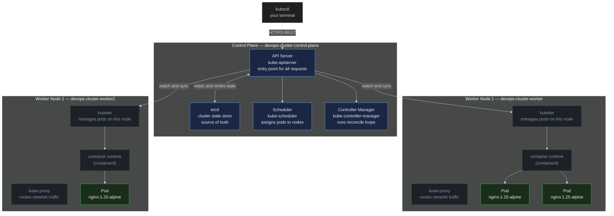
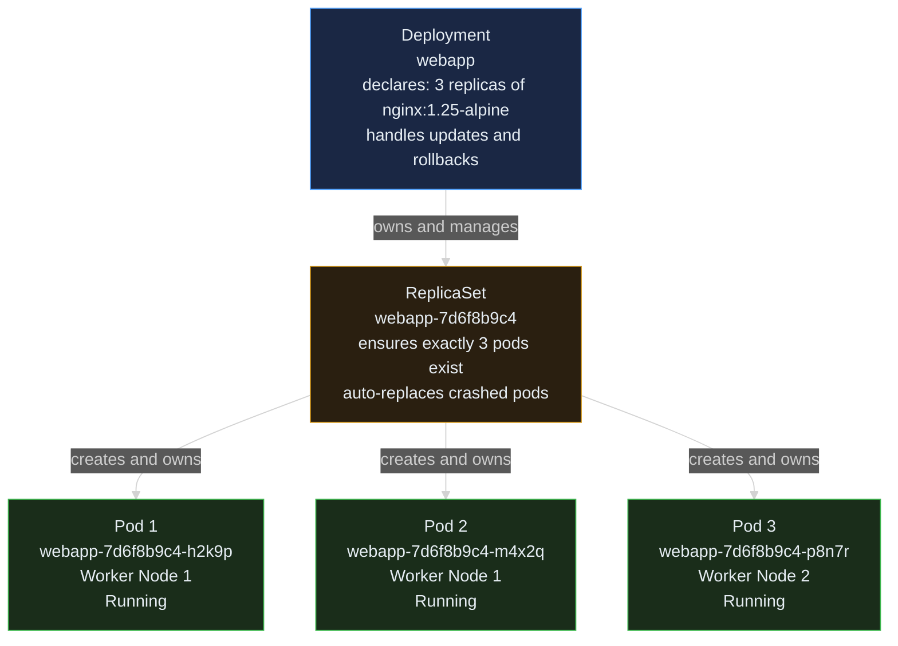
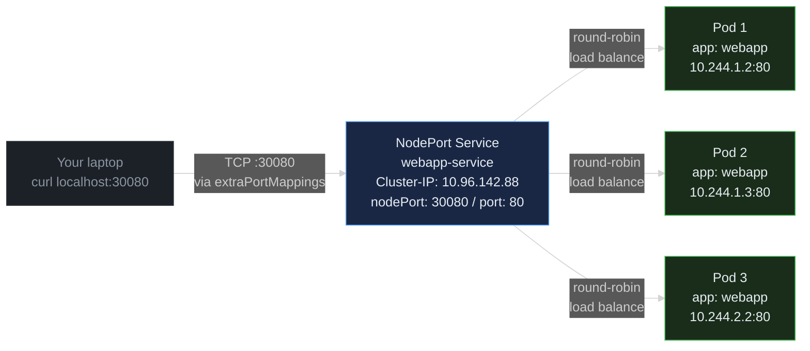
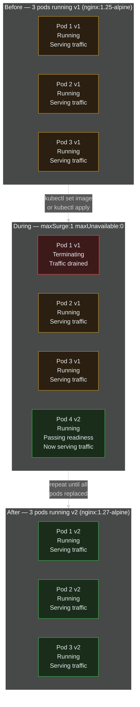

> **30 Days of DevOps** — Day 5 of 30. [← Day 4: GitHub Actions CI/CD](/articles/2026/05/15/day-04-github-actions-cicd/)

Docker Compose (Day 3) is perfect for local dev stacks. But once you need to run your app across multiple machines, recover automatically from failures, or roll out updates without downtime, you need Kubernetes.

In this article you will run a real, multi-node Kubernetes cluster on your laptop using **kind** (Kubernetes IN Docker), deploy an application, wire up health probes so Kubernetes knows when your app is truly ready, and perform a **zero-downtime rolling update** — all without touching a cloud provider.

## What you will build

By the end of this article you will have:

- A local 3-node Kubernetes cluster (1 control-plane + 2 workers) running in Docker
- A **Deployment** running 3 replicas of an nginx app
- A **NodePort Service** exposing the app on `localhost:30080`
- **Liveness and readiness probes** that gate traffic and auto-restart unhealthy pods
- A zero-downtime **rolling update** from v1 to v2 using `maxSurge` and `maxUnavailable`

---

## Prerequisites

| Tool | Minimum version | Check |
|---|---|---|
| Docker | 24.x | `docker --version` |
| kubectl | 1.29 | `kubectl version --client` |
| kind | 0.23 | `kind --version` |

**Install kubectl:**

```bash
# macOS
brew install kubectl

# Ubuntu / Debian
curl -LO "https://dl.k8s.io/release/$(curl -sL https://dl.k8s.io/release/stable.txt)/bin/linux/amd64/kubectl"
chmod +x kubectl && sudo mv kubectl /usr/local/bin/

# Windows (PowerShell)
winget install -e --id Kubernetes.kubectl
```

**Install kind:**

```bash
# macOS
brew install kind

# Linux
curl -Lo ./kind https://kind.sigs.k8s.io/dl/v0.23.0/kind-linux-amd64
chmod +x ./kind && sudo mv ./kind /usr/local/bin/

# Windows (PowerShell)
winget install -e --id Kubernetes.kind
```

**Full environment check:**

```bash
docker --version && kubectl version --client --short 2>/dev/null && kind --version
```

Expected output:

```text
Docker version 26.1.4, build 5650f9b
Client Version: v1.29.4
kind version 0.23.0
```

---

## Why Kubernetes?

Docker Compose runs containers on a single machine. That's fine for local development, but production workloads need more:

| Need | Docker Compose | Kubernetes |
|---|---|---|
| Multi-machine deployment | Manual | Built-in |
| Auto-restart on failure | `restart: always` | Always, across nodes |
| Rolling updates | Manual | Built-in, zero-downtime |
| Health-gated traffic | No | Readiness probes |
| Scale replicas | `docker compose scale` | `kubectl scale` |
| Self-healing | Limited | Full reconciliation loop |

Kubernetes achieves this through a **control loop**: you declare what you want (3 replicas of version 1.27), and Kubernetes continuously reconciles reality to match that declaration.

---

## Part 1 — Create the cluster

### The cluster config

Create a project directory and the kind cluster configuration:

```bash
mkdir -p ~/30-days-devops/day-05 && cd ~/30-days-devops/day-05
```

```bash
cat > kind-cluster.yaml << 'EOF'
kind: Cluster
apiVersion: kind.x-k8s.io/v1alpha4
nodes:
  - role: control-plane
    extraPortMappings:
      - containerPort: 30080
        hostPort: 30080
        protocol: TCP
  - role: worker
  - role: worker
EOF
```

The `extraPortMappings` block maps port 30080 on your laptop to port 30080 inside the kind control-plane container. Without this, NodePort services are unreachable from your host.

### Create the cluster

```bash
kind create cluster --name devops-cluster --config kind-cluster.yaml
```

Expected output:

```text
Creating cluster "devops-cluster" ...
 ✓ Ensuring node image (kindest/node:v1.29.2) 🖼
 ✓ Preparing nodes 📦 📦 📦
 ✓ Writing configuration 📜
 ✓ Starting control-plane 🕹️
 ✓ Installing CNI 🔌
 ✓ Installing StorageClass 💾
 ✓ Joining worker nodes 🚜
Set kubectl context to "kind-devops-cluster"
You can now use your cluster with:

kubectl cluster-info --context kind-devops-cluster
```

This takes 60–90 seconds on first run (downloading the node image). Subsequent runs are faster.

### Verify the cluster

```bash
kubectl get nodes
```

Expected output:

```text
NAME                           STATUS   ROLES           AGE   VERSION
devops-cluster-control-plane   Ready    control-plane   60s   v1.29.2
devops-cluster-worker          Ready    <none>          35s   v1.29.2
devops-cluster-worker2         Ready    <none>          35s   v1.29.2
```

All three nodes show `Ready`. The control-plane runs the Kubernetes brain (API server, scheduler, controller manager, etcd). The workers run your application pods.

```bash
kubectl get namespaces
```

Expected output:

```text
NAME              STATUS   AGE
default           Active   90s
kube-node-lease   Active   90s
kube-public       Active   90s
kube-system       Active   90s
```

`kube-system` is where Kubernetes runs its own internal pods (DNS, proxy, etc.). Your application will live in `default`.

### Kubernetes architecture



**Reading this diagram:**

The diagram splits into three areas: your terminal at the bottom, the control plane at the top, and two worker nodes in the middle.

Every `kubectl` command you run sends an HTTPS request to the **API Server** — the single front door to the entire cluster. The API Server reads and writes cluster state (what should exist) to **etcd**, a distributed key-value store that is the source of truth for everything. The **Scheduler** watches etcd for new pods with no assigned node and picks the best worker for them. The **Controller Manager** runs background loops that compare desired state (what you declared) to actual state (what's running) and reconciles differences — for example, if a pod crashes, the Deployment controller creates a replacement.

On each worker, **kubelet** watches the API Server for pods assigned to its node and instructs the **container runtime** (containerd) to pull images and start containers. **kube-proxy** maintains network rules so traffic destined for a Service reaches the right pods.

The key insight: you never talk directly to worker nodes. Everything goes through the API Server, and kubelet on each node independently pulls its instructions.

---

## Part 2 — Write the Deployment

A **Deployment** is the standard way to run a containerised application in Kubernetes. It manages a **ReplicaSet** (which in turn manages **Pods**) and provides update and rollback capabilities.

```bash
cat > deployment.yaml << 'EOF'
apiVersion: apps/v1
kind: Deployment
metadata:
  name: webapp
  labels:
    app: webapp
spec:
  replicas: 3
  selector:
    matchLabels:
      app: webapp
  strategy:
    type: RollingUpdate
    rollingUpdate:
      maxSurge: 1        # max pods above desired count during update
      maxUnavailable: 0  # zero pods may be unavailable during update
  template:
    metadata:
      labels:
        app: webapp
    spec:
      containers:
        - name: webapp
          image: nginx:1.25-alpine
          ports:
            - containerPort: 80
          resources:
            requests:
              cpu: "50m"
              memory: "64Mi"
            limits:
              cpu: "100m"
              memory: "128Mi"
EOF
```

Apply the Deployment:

```bash
kubectl apply -f deployment.yaml
```

Expected output:

```text
deployment.apps/webapp created
```

Watch the pods come up:

```bash
kubectl get pods -w
```

Expected output:

```text
NAME                      READY   STATUS              RESTARTS   AGE
webapp-7d6f8b9c4-h2k9p   0/1     ContainerCreating   0          3s
webapp-7d6f8b9c4-m4x2q   0/1     ContainerCreating   0          3s
webapp-7d6f8b9c4-p8n7r   0/1     ContainerCreating   0          3s
webapp-7d6f8b9c4-h2k9p   1/1     Running             0          8s
webapp-7d6f8b9c4-m4x2q   1/1     Running             0          9s
webapp-7d6f8b9c4-p8n7r   1/1     Running             0          10s
```

Press `Ctrl+C` to stop watching. Check the full Deployment status:

```bash
kubectl get deployment webapp
```

Expected output:

```text
NAME     READY   UP-TO-DATE   AVAILABLE   AGE
webapp   3/3     3            3           45s
```

`3/3` means all 3 desired replicas are running and available.

### Deployment → ReplicaSet → Pods



**Reading this diagram:**

Read top to bottom. The **Deployment** (blue) is what you interact with — it's the object you declared in `deployment.yaml`. It owns a **ReplicaSet** (yellow/amber), which is an automatically created child object whose only job is to ensure exactly 3 pods exist at all times. If you manually delete a pod, the ReplicaSet notices the count has dropped to 2 and immediately creates a replacement. Each **Pod** (green) runs on a worker node and contains one nginx container.

You rarely interact with ReplicaSets directly. The Deployment manages them automatically — when you perform a rolling update, the Deployment creates a second ReplicaSet (for the new version) and scales it up while scaling the old one down. Old ReplicaSets are kept for rollback purposes but their replica count is set to zero.

The key insight: the Deployment is your API — you change it, Kubernetes handles the rest.

---

## Part 3 — Expose it with a Service

Pods have internal cluster IPs that change every time a pod is recreated. A **Service** provides a stable endpoint that load-balances traffic across all matching pods.

```bash
cat > service.yaml << 'EOF'
apiVersion: v1
kind: Service
metadata:
  name: webapp-service
spec:
  type: NodePort
  selector:
    app: webapp     # routes to any pod with this label
  ports:
    - port: 80       # port on the Service (cluster-internal)
      targetPort: 80 # port on the Pod
      nodePort: 30080 # port on the Node (accessible from your laptop)
EOF
```

Apply the Service:

```bash
kubectl apply -f service.yaml
```

Expected output:

```text
service/webapp-service created
```

Verify:

```bash
kubectl get service webapp-service
```

Expected output:

```text
NAME             TYPE       CLUSTER-IP      EXTERNAL-IP   PORT(S)        AGE
webapp-service   NodePort   10.96.142.88    <none>        80:30080/TCP   10s
```

Test the app:

```bash
curl -s localhost:30080 | grep -o '<title>.*</title>'
```

Expected output:

```text
<title>Welcome to nginx!</title>
```

The app is live. Every `curl` goes through the Service, which round-robins traffic across all 3 pods.

### How the Service routes traffic



**Reading this diagram:**

Read left to right. A request from **your laptop** on port 30080 enters the kind cluster via the `extraPortMappings` tunnel configured in `kind-cluster.yaml`. It hits the **NodePort Service** (blue), which holds a stable ClusterIP (`10.96.142.88`) and knows which pods to route to via the `app: webapp` label selector.

The Service distributes traffic in round-robin across all three **Pods** (green), each with its own cluster-internal IP on the `10.244.x.x` Pod CIDR. If a pod is deleted and recreated with a new IP, the Service automatically discovers it via the label — no config change needed.

The key insight: the Service is a label-based router, not a fixed list of IPs. Any pod with `app: webapp` automatically receives traffic.

---

## Part 4 — Health probes

Without probes, Kubernetes sends traffic to a pod the moment the container starts — even if the app inside hasn't finished booting. Probes fix this.

| Probe | What it checks | What happens on failure |
|---|---|---|
| **Readiness** | Is the app ready to serve traffic? | Pod removed from Service endpoints — no traffic sent |
| **Liveness** | Is the app still alive? | Pod restarted |

Both probes run `GET /` on port 80 every few seconds. Update the Deployment to add them:

```bash
cat > deployment.yaml << 'EOF'
apiVersion: apps/v1
kind: Deployment
metadata:
  name: webapp
  labels:
    app: webapp
spec:
  replicas: 3
  selector:
    matchLabels:
      app: webapp
  strategy:
    type: RollingUpdate
    rollingUpdate:
      maxSurge: 1
      maxUnavailable: 0
  template:
    metadata:
      labels:
        app: webapp
    spec:
      containers:
        - name: webapp
          image: nginx:1.25-alpine
          ports:
            - containerPort: 80
          readinessProbe:
            httpGet:
              path: /
              port: 80
            initialDelaySeconds: 5   # wait 5s before first check
            periodSeconds: 5         # check every 5s
            failureThreshold: 3      # fail 3 times before marking Not Ready
          livenessProbe:
            httpGet:
              path: /
              port: 80
            initialDelaySeconds: 10  # wait longer — app needs to be up first
            periodSeconds: 10        # check every 10s
            failureThreshold: 3      # restart after 3 consecutive failures
          resources:
            requests:
              cpu: "50m"
              memory: "64Mi"
            limits:
              cpu: "100m"
              memory: "128Mi"
EOF
```

Apply the updated Deployment:

```bash
kubectl apply -f deployment.yaml
```

Expected output:

```text
deployment.apps/webapp configured
```

Kubernetes performs a rolling update to apply the probe configuration. Verify all pods are still running:

```bash
kubectl get pods
```

Expected output:

```text
NAME                      READY   STATUS    RESTARTS   AGE
webapp-6b8d9c7f5-j3k4l   1/1     Running   0          25s
webapp-6b8d9c7f5-n7p8q   1/1     Running   0          30s
webapp-6b8d9c7f5-r2s5t   1/1     Running   0          35s
```

The `1/1` in the `READY` column means 1 of 1 containers are passing their readiness probe — confirming the pod is receiving traffic.

Inspect the probes on a running pod:

```bash
kubectl describe pod $(kubectl get pods -l app=webapp -o name | head -1) | grep -A 10 "Liveness\|Readiness"
```

Expected output:

```text
    Liveness:   http-get http://:80/ delay=10s timeout=1s period=10s #success=1 #failure=3
    Readiness:  http-get http://:80/ delay=5s timeout=1s period=5s #success=1 #failure=3
```

---

## Part 5 — Zero-downtime rolling update

A rolling update replaces pods one at a time (or in small batches), ensuring your app stays available throughout the process.

With our strategy:
- `maxSurge: 1` — Kubernetes may create 1 extra pod beyond the desired 3 (total 4 at peak)
- `maxUnavailable: 0` — No pod may be removed until its replacement is **Ready**

This guarantees zero downtime: there are always at least 3 ready pods serving traffic.

### Trigger the update

Update the image from `nginx:1.25-alpine` to `nginx:1.27-alpine`:

```bash
kubectl set image deployment/webapp webapp=nginx:1.27-alpine
```

Expected output:

```text
deployment.apps/webapp image updated
```

### Watch it roll

In a second terminal, watch the pods:

```bash
kubectl get pods -w
```

Expected output (condensed):

```text
NAME                      READY   STATUS              RESTARTS   AGE
webapp-6b8d9c7f5-j3k4l   1/1     Running             0          3m
webapp-6b8d9c7f5-n7p8q   1/1     Running             0          3m
webapp-6b8d9c7f5-r2s5t   1/1     Running             0          3m
webapp-8f9a1b2c6-x4y5z   0/1     ContainerCreating   0          4s
webapp-8f9a1b2c6-x4y5z   1/1     Running             0          12s
webapp-6b8d9c7f5-j3k4l   1/1     Terminating         0          3m
webapp-8f9a1b2c6-a7b8c   0/1     ContainerCreating   0          2s
webapp-8f9a1b2c6-a7b8c   1/1     Running             0          10s
webapp-6b8d9c7f5-n7p8q   1/1     Terminating         0          3m
webapp-8f9a1b2c6-d1e2f   0/1     ContainerCreating   0          2s
webapp-8f9a1b2c6-d1e2f   1/1     Running             0          11s
webapp-6b8d9c7f5-r2s5t   1/1     Terminating         0          3m
```

In the first terminal, check rollout status:

```bash
kubectl rollout status deployment/webapp
```

Expected output:

```text
Waiting for deployment "webapp" rollout to finish: 1 out of 3 new replicas have been updated...
Waiting for deployment "webapp" rollout to finish: 2 out of 3 new replicas have been updated...
Waiting for deployment "webapp" rollout to finish: 1 old replicas are pending termination...
deployment "webapp" successfully rolled out
```

Verify the new image is running:

```bash
kubectl get deployment webapp -o wide
```

Expected output:

```text
NAME     READY   UP-TO-DATE   AVAILABLE   AGE   CONTAINERS   IMAGES              SELECTOR
webapp   3/3     3            3           5m    webapp       nginx:1.27-alpine   app=webapp
```

### Rollback if something goes wrong

Kubernetes keeps the previous ReplicaSet. Roll back instantly:

```bash
kubectl rollout undo deployment/webapp
```

Expected output:

```text
deployment.apps/webapp rolled back
```

View rollout history:

```bash
kubectl rollout history deployment/webapp
```

Expected output:

```text
deployment.apps/webapp
REVISION  CHANGE-CAUSE
1         <none>
2         <none>
3         <none>
```

> **Note:** `kubectl rollout undo` does **not** delete revision 2 — it creates a new revision 3 whose spec is identical to revision 1. All three revisions remain in history. Use `--record` flag when applying to populate the `CHANGE-CAUSE` column with your command.

### How the rolling update works



**Reading this diagram:**

Read top to bottom. The diagram shows three phases of the rolling update.

**Before** (amber/yellow pods): Three v1 pods are running and serving all traffic. This is the stable initial state.

**During** (mixed colours): Kubernetes creates one new v2 pod first (green, bottom-right). It waits for this pod to pass its **readiness probe** before touching any v1 pod. Once the v2 pod is Ready and serving traffic, one v1 pod is marked **Terminating** (red, top-left) — Kubernetes stops sending it new traffic and allows in-flight requests to drain. At this moment there are still 3 pods actively serving traffic (2 v1 + 1 v2), satisfying `maxUnavailable: 0`. This same cycle repeats for the remaining two v1 pods.

**After** (green pods): All three pods are now running v2. The old ReplicaSet still exists with zero replicas, ready to serve as the rollback target.

The key insight: the readiness probe is what makes zero-downtime possible. Kubernetes will not terminate an old pod until its replacement is proven healthy. Without a readiness probe, a new pod is considered ready the moment its container starts — before your app has actually booted.

---

## Cleanup

When you are done, delete the cluster:

```bash
kind delete cluster --name devops-cluster
```

Expected output:

```text
Deleting cluster "devops-cluster" ...
Deleted nodes: ["devops-cluster-control-plane" "devops-cluster-worker" "devops-cluster-worker2"]
```

---

## Common errors

### Error 1 — Cluster already exists

```text
ERROR: failed to create cluster: node(s) already exist for a cluster with the name "devops-cluster"
```

**Cause:** You already have a kind cluster with this name from a previous run.

**Fix:**

```bash
kind delete cluster --name devops-cluster
kind create cluster --name devops-cluster --config kind-cluster.yaml
```

---

### Error 2 — kubectl cannot connect to cluster

```text
The connection to the server localhost:8080 was refused
```

**Cause:** kubectl is pointing at the wrong context or the cluster is not running.

**Fix:**

```bash
# List available contexts
kubectl config get-contexts

# Switch to the kind context
kubectl config use-context kind-devops-cluster

# Verify the cluster is running
kind get clusters
```

---

### Error 3 — Port 30080 already in use

```text
ERROR: failed to create cluster: failed to create kubeadm config:
failed to get config: open /var/run/docker.sock: permission denied
```

Or when binding port:

```text
Bind for 0.0.0.0:30080 failed: port is already allocated
```

**Cause:** Something else is already using port 30080 on your machine.

**Fix:**

```bash
# Find what's using port 30080
lsof -i :30080

# Kill the process or change nodePort in service.yaml and
# containerPort/hostPort in kind-cluster.yaml to an unused port (e.g. 30081)
```

---

### Error 4 — Pods stuck in Pending

```text
NAME                      READY   STATUS    RESTARTS   AGE
webapp-7d6f8b9c4-h2k9p   0/1     Pending   0          2m
```

**Cause:** Usually insufficient memory allocated to Docker Desktop.

**Fix:**

```bash
# Check why the pod is pending
kubectl describe pod webapp-7d6f8b9c4-h2k9p | grep -A 5 Events

# Common output: 0/3 nodes are available: 3 Insufficient memory
# Fix: Docker Desktop -> Settings -> Resources -> increase Memory to 4GB+
# Or reduce resource requests in deployment.yaml
```

---

### Error 5 — ImagePullBackOff

```text
NAME                      READY   STATUS             RESTARTS   AGE
webapp-7d6f8b9c4-h2k9p   0/1     ImagePullBackOff   0          30s
```

**Cause:** The image name or tag doesn't exist, or Docker Hub rate limit hit.

**Fix:**

```bash
# Check the exact error
kubectl describe pod webapp-7d6f8b9c4-h2k9p | grep -A 3 "Warning"

# Pull the image manually to confirm it exists
docker pull nginx:1.25-alpine

# If rate limited, log in to Docker Hub
docker login
```

---

### Error 6 — Pods not ready after probe added

```text
NAME                      READY   STATUS    RESTARTS   AGE
webapp-6b8d9c7f5-j3k4l   0/1     Running   0          20s
```

**Cause:** The readiness probe's `initialDelaySeconds` hasn't elapsed yet, or the probe endpoint is wrong.

**Fix:**

```bash
# Check probe events on the pod
kubectl describe pod webapp-6b8d9c7f5-j3k4l | grep -A 5 "Readiness"

# If endpoint is wrong, update the path in deployment.yaml
# If just slow to start, increase initialDelaySeconds

# Watch until ready
kubectl get pods -w
```

---

## What you built

In this article you:

- Created a **3-node kind cluster** that mirrors a real Kubernetes setup — control-plane and two workers
- Deployed an app with a **Deployment** specifying 3 replicas, resource limits, and a rolling update strategy
- Exposed it with a **NodePort Service** accessible on `localhost:30080`
- Wired **liveness and readiness probes** so Kubernetes can detect and recover from unhealthy apps
- Performed a **zero-downtime rolling update** (v1 → v2) using `maxSurge: 1` and `maxUnavailable: 0`
- Verified **instant rollback** with `kubectl rollout undo`

Your local cluster setup:

```text
~/30-days-devops/day-05/
├── kind-cluster.yaml     # 3-node cluster with NodePort mapping
├── deployment.yaml       # webapp Deployment with probes + rolling strategy
└── service.yaml          # NodePort Service on port 30080
```

---

## Day 6 — Helm: Package Manager for Kubernetes

In Day 6 we take the YAML files you wrote today and turn them into a **Helm chart** — a reusable, versioned package for Kubernetes applications. You will:

- Understand why raw YAML doesn't scale past a handful of services
- Install Helm and create your first chart from scratch
- Use **values.yaml** to configure the same chart for dev, staging, and prod
- Install, upgrade, and rollback releases with a single command

[Day 6 coming soon →]
