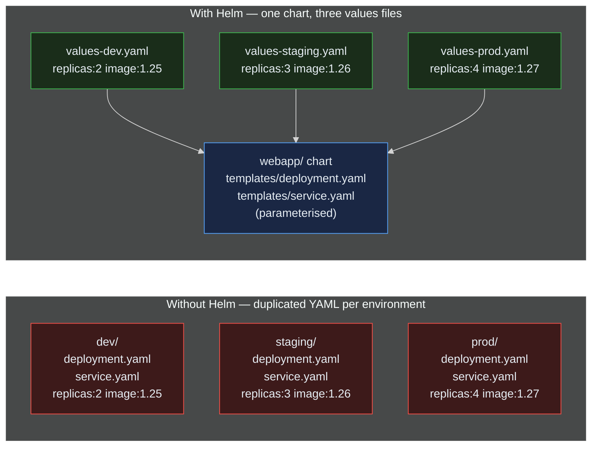
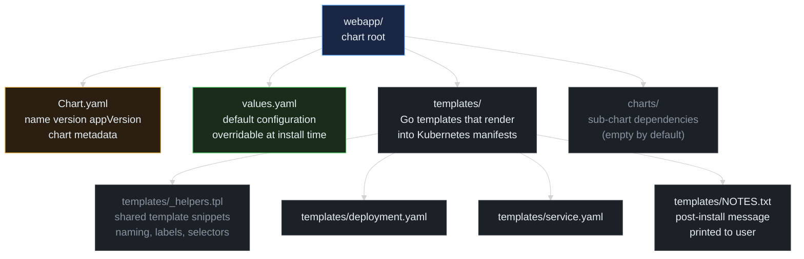
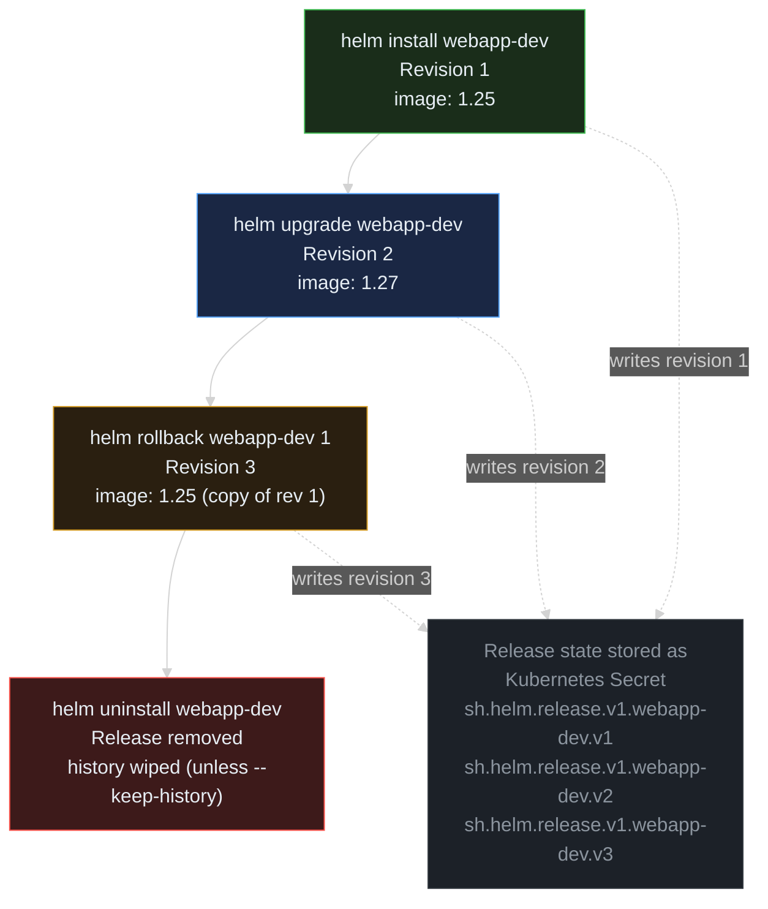

> **30 Days of DevOps** — Day 6 of 30. [← Day 5: Kubernetes Fundamentals](/articles/2026/05/16/day-05-kubernetes-fundamentals/)

In [Day 5](/articles/2026/05/16/day-05-kubernetes-fundamentals/) you wrote `deployment.yaml`, `service.yaml`, and `kind-cluster.yaml` by hand. That works for one app in one environment. Now imagine running that same app in **dev**, **staging**, and **prod**, each with different replica counts, image tags, and resource limits. You would copy those YAML files three times and edit them — and every change would need to be applied three times.

**Helm** solves this. A Helm **chart** is a templated package of Kubernetes manifests. You write the templates once, supply environment-specific values in a `values.yaml` file, and install the same chart anywhere with a single command.

## What you will build

By the end of this article you will have:

- A working **Helm chart** packaging the nginx Deployment and Service from Day 5
- A `values.yaml` driving image, replicas, ports, and probe config
- **Two environment-specific value files** — `values-dev.yaml` and `values-prod.yaml`
- A **dev release** running 2 replicas, a **prod release** running 4 replicas on the same chart
- Hands-on `helm upgrade` and `helm rollback` workflows

---

## Prerequisites

This article continues from Day 5. You will need the kind cluster from that article running, plus Helm installed.

| Tool | Minimum version | Check |
|---|---|---|
| Docker | 24.x | `docker --version` |
| kubectl | 1.29 | `kubectl version --client` |
| kind | 0.23 | `kind --version` |
| Helm | 3.14 | `helm version --short` |

**Install Helm:**

```bash
# macOS
brew install helm

# Linux
curl -fsSL https://raw.githubusercontent.com/helm/helm/main/scripts/get-helm-3 | bash

# Windows (PowerShell)
winget install -e --id Helm.Helm
```

**Verify your environment:**

```bash
helm version --short
```

Expected output:

```text
v3.14.4+g81c902a
```

If the kind cluster from Day 5 is not running, recreate it:

```bash
cd ~/30-days-devops/day-05
kind create cluster --name devops-cluster --config kind-cluster.yaml
kubectl cluster-info --context kind-devops-cluster
```

---

## Why Helm? The YAML duplication problem

Plain Kubernetes YAML is declarative and explicit, but it has no built-in way to vary values between environments. Watch what happens when you need three environments:



**Reading this diagram:**

The **"Without Helm"** subgraph (red boxes) shows the raw-YAML approach: one folder per environment, each containing a full copy of `deployment.yaml` and `service.yaml`. The differences between them are tiny — just a few fields like `replicas` and `image:tag` — but the **entire file** must be duplicated because YAML has no variable substitution. Notice there are no arrows inside this subgraph — each environment's files stand alone, with no shared source to keep them in sync. When you change a label across all environments, you edit three files. When the schema evolves, you edit three files. Drift is inevitable.

The **"With Helm"** subgraph (green and blue boxes) shows the Helm approach. A single **chart** (blue) contains parameterised templates — the same `deployment.yaml` and `service.yaml`, but with placeholders like `{{ .Values.replicaCount }}` instead of hard-coded numbers. Three small **values files** (green) supply just the differences for each environment. The three arrows from the values files into the chart represent each `helm install -f values-<env>.yaml` invocation feeding environment-specific overrides into the same shared chart at render time — Helm merges them over the chart's defaults to produce the final manifests. Updates to shared structure happen once, in the chart.

The key insight: Helm splits **structure** (templates, shared across environments) from **configuration** (values, unique per environment). You stop duplicating YAML and start composing it.

---

## Part 1 — Helm chart anatomy

A Helm chart is a directory with a specific layout. Before generating one, understand what each piece does:



**Reading this diagram:**

Read top to bottom. At the top sits the chart root directory (blue), named after the chart itself — in our case `webapp/`. Inside, **four top-level items** hang off the root. Three of them carry the day-to-day work of authoring a chart; the fourth (`charts/`, faded grey) is reserved for sub-chart dependencies and stays empty for our simple chart.

Note the colour convention used inside the grey boxes: **bright white text** marks files that produce real Kubernetes manifests applied to the cluster, while **muted grey text** marks supporting files that Helm reads but never applies directly.

**`Chart.yaml`** (amber) holds chart metadata: a name, a chart version (the chart's own version), and an appVersion (the version of the app the chart deploys). Helm refuses to install a chart without this file.

**`values.yaml`** (green) is the default configuration. Every parameter your templates reference must have a default here. At install time, callers can override individual values from the command line (`--set replicaCount=4`) or from a separate values file (`-f values-prod.yaml`).

**`templates/`** (grey) is where the Kubernetes YAML lives, but written as Go templates with placeholders. Its four children fall into three roles:
- **`_helpers.tpl`** (muted-grey text, matching `charts/` — the underscore prefix and muted colour both signal that Helm treats these as include-only, not as manifests to apply) holds shared snippets like the standard label block.
- The actual manifest templates (`deployment.yaml` and `service.yaml`, bright-white text) get rendered with values substituted, then applied to the cluster.
- **`NOTES.txt`** (bright-white text) is a special template whose rendered output is printed to the user immediately after `helm install` — useful for connection instructions or next steps.

The key insight: Helm is a templating layer plus a release manager on top of standard Kubernetes manifests. Nothing in a rendered chart is exotic — it produces the same YAML you wrote by hand in Day 5.

---

## Part 2 — Generate the chart

Helm ships a `helm create` command that scaffolds a chart with sensible defaults. We will scaffold one, then strip it down to just what we need.

Create a fresh project directory:

```bash
mkdir -p ~/30-days-devops/day-06 && cd ~/30-days-devops/day-06
```

Generate the chart:

```bash
helm create webapp
```

Expected output:

```text
Creating webapp
```

Inspect what got created:

```bash
ls -la webapp/
```

Expected output:

```text
total 16
drwxr-xr-x   8 user  staff   256 May 17 09:00 .
drwxr-xr-x   3 user  staff    96 May 17 09:00 ..
-rw-r--r--   1 user  staff   349 May 17 09:00 .helmignore
-rw-r--r--   1 user  staff  1167 May 17 09:00 Chart.yaml
drwxr-xr-x   2 user  staff    64 May 17 09:00 charts
drwxr-xr-x  10 user  staff   320 May 17 09:00 templates
-rw-r--r--   1 user  staff  1879 May 17 09:00 values.yaml
```

The scaffold includes more templates than we need (an Ingress, ServiceAccount, HPA, and a test pod). For a clean Day 6 chart, start fresh — remove the scaffold templates and write only what we need:

```bash
rm webapp/templates/*.yaml webapp/templates/tests/test-connection.yaml
rmdir webapp/templates/tests
ls webapp/templates/
```

Expected output:

```text
NOTES.txt    _helpers.tpl
```

We keep `_helpers.tpl` (it contains useful name/label helpers) and `NOTES.txt` (printed after install). Everything else we will write from scratch.

---

## Part 3 — Write the templates

Three template files: `deployment.yaml`, `service.yaml`, and an updated `NOTES.txt`. Then we will edit `values.yaml` to drive them.

### deployment.yaml

```bash
cat > webapp/templates/deployment.yaml << 'EOF'
apiVersion: apps/v1
kind: Deployment
metadata:
  name: {{ include "webapp.fullname" . }}
  labels:
    {{- include "webapp.labels" . | nindent 4 }}
spec:
  replicas: {{ .Values.replicaCount }}
  strategy:
    type: RollingUpdate
    rollingUpdate:
      maxSurge: {{ .Values.rollingUpdate.maxSurge }}
      maxUnavailable: {{ .Values.rollingUpdate.maxUnavailable }}
  selector:
    matchLabels:
      {{- include "webapp.selectorLabels" . | nindent 6 }}
  template:
    metadata:
      labels:
        {{- include "webapp.selectorLabels" . | nindent 8 }}
    spec:
      containers:
        - name: {{ .Chart.Name }}
          image: "{{ .Values.image.repository }}:{{ .Values.image.tag }}"
          imagePullPolicy: {{ .Values.image.pullPolicy }}
          ports:
            - name: http
              containerPort: {{ .Values.service.targetPort }}
              protocol: TCP
          readinessProbe:
            httpGet:
              path: /
              port: http
            initialDelaySeconds: {{ .Values.probes.readiness.initialDelaySeconds }}
            periodSeconds: {{ .Values.probes.readiness.periodSeconds }}
          livenessProbe:
            httpGet:
              path: /
              port: http
            initialDelaySeconds: {{ .Values.probes.liveness.initialDelaySeconds }}
            periodSeconds: {{ .Values.probes.liveness.periodSeconds }}
          resources:
            {{- toYaml .Values.resources | nindent 12 }}
EOF
```

Every value with `{{ ... }}` will be filled in from `values.yaml` at render time. The `include` calls pull in shared label and naming snippets defined in `_helpers.tpl` — these were generated by `helm create` and stay as-is.

### service.yaml

```bash
cat > webapp/templates/service.yaml << 'EOF'
apiVersion: v1
kind: Service
metadata:
  name: {{ include "webapp.fullname" . }}
  labels:
    {{- include "webapp.labels" . | nindent 4 }}
spec:
  type: {{ .Values.service.type }}
  ports:
    - port: {{ .Values.service.port }}
      targetPort: http
      protocol: TCP
      name: http
      {{- if and (eq .Values.service.type "NodePort") .Values.service.nodePort }}
      nodePort: {{ .Values.service.nodePort }}
      {{- end }}
  selector:
    {{- include "webapp.selectorLabels" . | nindent 4 }}
EOF
```

The `{{- if and ... }}` block only emits the `nodePort` line if the service type is `NodePort` **and** a port number was set. This means the same template works for `ClusterIP` (internal) and `NodePort` (externally exposed) services.

### NOTES.txt

```bash
cat > webapp/templates/NOTES.txt << 'EOF'
Release {{ .Release.Name }} installed in namespace {{ .Release.Namespace }}.

To check status:
  kubectl get pods -l "app.kubernetes.io/instance={{ .Release.Name }}"

{{- if eq .Values.service.type "NodePort" }}

Your service is exposed on NodePort {{ .Values.service.nodePort }}.
Open: http://localhost:{{ .Values.service.nodePort }}
{{- end }}
EOF
```

---

## Part 4 — Rewrite values.yaml

The default `values.yaml` generated by `helm create` is verbose. Replace it with one tailored to our templates:

```bash
cat > webapp/values.yaml << 'EOF'
# Default values for webapp chart.
# Override these from the CLI (--set) or from a values file (-f).

replicaCount: 3

image:
  repository: nginx
  tag: "1.25-alpine"
  pullPolicy: IfNotPresent

rollingUpdate:
  maxSurge: 1
  maxUnavailable: 0

service:
  type: NodePort
  port: 80
  targetPort: 80
  nodePort: 30080

probes:
  readiness:
    initialDelaySeconds: 5
    periodSeconds: 5
  liveness:
    initialDelaySeconds: 10
    periodSeconds: 10

resources:
  requests:
    cpu: 50m
    memory: 64Mi
  limits:
    cpu: 100m
    memory: 128Mi
EOF
```

Every value here can be overridden at install time. Notice the structure mirrors what we used in Day 5 — same image, same probe timings, same resource limits.

---

## Part 5 — Render before installing

Before applying anything to the cluster, render the chart locally and check the output. This catches template errors early.

```bash
helm template my-release ./webapp
```

Expected output (truncated):

```text
---
# Source: webapp/templates/service.yaml
apiVersion: v1
kind: Service
metadata:
  name: my-release-webapp
  labels:
    helm.sh/chart: webapp-0.1.0
    app.kubernetes.io/name: webapp
    app.kubernetes.io/instance: my-release
    app.kubernetes.io/version: "1.16.0"
    app.kubernetes.io/managed-by: Helm
spec:
  type: NodePort
  ports:
    - port: 80
      targetPort: http
      protocol: TCP
      name: http
      nodePort: 30080
  selector:
    app.kubernetes.io/name: webapp
    app.kubernetes.io/instance: my-release
---
# Source: webapp/templates/deployment.yaml
apiVersion: apps/v1
kind: Deployment
metadata:
  name: my-release-webapp
  labels:
    helm.sh/chart: webapp-0.1.0
    app.kubernetes.io/name: webapp
    app.kubernetes.io/instance: my-release
    app.kubernetes.io/version: "1.16.0"
    app.kubernetes.io/managed-by: Helm
spec:
  replicas: 3
  ...
```

If there is a template syntax error, `helm template` reports it with a line number. Fix locally before any `helm install`.

Lint the chart for additional checks:

```bash
helm lint ./webapp
```

Expected output:

```text
==> Linting ./webapp

1 chart(s) linted, 0 chart(s) failed
```

---

## Part 6 — Install the chart (dev release)

A Helm **release** is one installed instance of a chart. You can install the same chart multiple times under different release names.

Create a values file for the dev environment:

```bash
cat > values-dev.yaml << 'EOF'
replicaCount: 2

image:
  tag: "1.25-alpine"

resources:
  requests:
    cpu: 25m
    memory: 32Mi
  limits:
    cpu: 50m
    memory: 64Mi
EOF
```

This only contains the **differences** from the chart's defaults. Everything else (service type, nodePort, probes) comes from `values.yaml`.

Install the release:

```bash
helm install webapp-dev ./webapp -f values-dev.yaml
```

Expected output:

```text
NAME: webapp-dev
LAST DEPLOYED: Sun May 17 09:15:42 2026
NAMESPACE: default
STATUS: deployed
REVISION: 1
NOTES:
Release webapp-dev installed in namespace default.

To check status:
  kubectl get pods -l "app.kubernetes.io/instance=webapp-dev"

Your service is exposed on NodePort 30080.
Open: http://localhost:30080
```

The `NOTES.txt` we wrote earlier shows up at the bottom. Verify the pods:

```bash
kubectl get pods -l "app.kubernetes.io/instance=webapp-dev"
```

Expected output:

```text
NAME                          READY   STATUS    RESTARTS   AGE
webapp-dev-webapp-7f9c8d-a1   1/1     Running   0          15s
webapp-dev-webapp-7f9c8d-b2   1/1     Running   0          15s
```

Two pods, exactly what `values-dev.yaml` requested. Test it:

```bash
curl -s localhost:30080 | grep -o '<title>.*</title>'
```

Expected output:

```text
<title>Welcome to nginx!</title>
```

List the release:

```bash
helm list
```

Expected output:

```text
NAME        NAMESPACE   REVISION    UPDATED                                 STATUS      CHART           APP VERSION
webapp-dev  default     1           2026-05-17 09:15:42.123 +0000 UTC       deployed    webapp-0.1.0    1.16.0
```

---

## Part 7 — Upgrade the release

Edit `values-dev.yaml` to bump the image and increase replicas:

```bash
cat > values-dev.yaml << 'EOF'
replicaCount: 3

image:
  tag: "1.27-alpine"

resources:
  requests:
    cpu: 25m
    memory: 32Mi
  limits:
    cpu: 50m
    memory: 64Mi
EOF
```

Apply the upgrade:

```bash
helm upgrade webapp-dev ./webapp -f values-dev.yaml
```

Expected output:

```text
Release "webapp-dev" has been upgraded. Happy Helming!
NAME: webapp-dev
LAST DEPLOYED: Sun May 17 09:20:11 2026
NAMESPACE: default
STATUS: deployed
REVISION: 2
```

Revision incremented from 1 to 2. Watch the rolling update happen:

```bash
kubectl get pods -l "app.kubernetes.io/instance=webapp-dev" -w
```

Expected output (condensed):

```text
NAME                          READY   STATUS              RESTARTS   AGE
webapp-dev-webapp-7f9c8d-a1   1/1     Running             0          5m
webapp-dev-webapp-7f9c8d-b2   1/1     Running             0          5m
webapp-dev-webapp-9a2b1e-c3   0/1     ContainerCreating   0          2s
webapp-dev-webapp-9a2b1e-c3   1/1     Running             0          10s
webapp-dev-webapp-7f9c8d-a1   1/1     Terminating         0          5m
webapp-dev-webapp-9a2b1e-d4   0/1     ContainerCreating   0          2s
webapp-dev-webapp-9a2b1e-d4   1/1     Running             0          10s
webapp-dev-webapp-7f9c8d-b2   1/1     Terminating         0          5m
webapp-dev-webapp-9a2b1e-e5   0/1     ContainerCreating   0          2s
webapp-dev-webapp-9a2b1e-e5   1/1     Running             0          10s
```

Press `Ctrl+C` to stop. Confirm the new image is running:

```bash
kubectl get deployment webapp-dev-webapp -o jsonpath='{.spec.template.spec.containers[0].image}'
```

Expected output:

```text
nginx:1.27-alpine
```

---

## Part 8 — Rollback

Helm keeps every revision. View the history:

```bash
helm history webapp-dev
```

Expected output:

```text
REVISION    UPDATED                     STATUS      CHART           APP VERSION   DESCRIPTION
1           Sun May 17 09:15:42 2026    superseded  webapp-0.1.0    1.16.0        Install complete
2           Sun May 17 09:20:11 2026    deployed    webapp-0.1.0    1.16.0        Upgrade complete
```

Roll back to revision 1:

```bash
helm rollback webapp-dev 1
```

Expected output:

```text
Rollback was a success! Happy Helming!
```

Check the history again:

```bash
helm history webapp-dev
```

Expected output:

```text
REVISION    UPDATED                     STATUS      CHART           APP VERSION   DESCRIPTION
1           Sun May 17 09:15:42 2026    superseded  webapp-0.1.0    1.16.0        Install complete
2           Sun May 17 09:20:11 2026    superseded  webapp-0.1.0    1.16.0        Upgrade complete
3           Sun May 17 09:23:08 2026    deployed    webapp-0.1.0    1.16.0        Rollback to 1
```

Just like Kubernetes itself (Day 5), the rollback creates a **new revision** (3) whose spec is copied from revision 1. The old revisions stay in history.

Confirm the image rolled back:

```bash
kubectl get deployment webapp-dev-webapp -o jsonpath='{.spec.template.spec.containers[0].image}'
```

Expected output:

```text
nginx:1.25-alpine
```

---

## Part 9 — Release lifecycle



**Reading this diagram:**

Read top to bottom. The lifecycle of a Helm release flows through four commands:

**`helm install`** (green) creates the release at revision 1 and applies all rendered manifests to the cluster. **`helm upgrade`** (blue) re-renders the chart with new values, applies the changes, and bumps the revision to 2. **`helm rollback ... 1`** (amber) does not delete revision 2 — it copies the spec from revision 1 into a brand-new revision 3 and re-applies it. **`helm uninstall`** (red) removes the release from the cluster entirely — deleting both the manifests it created **and** the revision Secrets in storage. Notice there is no dotted arrow from `uninstall` to the grey box: uninstall does not write a new revision, it erases the existing ones. Pass `--keep-history` to retain the Secrets so the release can later be recovered.

Off to the side (grey box, reached by **dotted** arrows — distinct from the **solid** command-flow arrows of the main lifecycle chain), each revision is persisted as a Kubernetes Secret in the release's namespace, with names like `sh.helm.release.v1.webapp-dev.v2`. Each dotted arrow's label maps a command to its written revision: install → v1, upgrade → v2, rollback → v3. The cluster itself stores the release history — Helm reads from these Secrets every time you run `helm history` or `helm rollback`. This is why you can switch laptops and still see the same release state: the source of truth lives in the cluster, not in your client.

The key insight: a Helm release is more than just the manifests it applied — it is the **history of revisions**, persisted in-cluster. Rollback works because the previous revision's spec is still there to copy from.

---

## Part 10 — Production release with different values

Now use the same chart for a second environment. Create `values-prod.yaml`:

```bash
cat > values-prod.yaml << 'EOF'
replicaCount: 4

image:
  tag: "1.27-alpine"

service:
  nodePort: 30081

resources:
  requests:
    cpu: 100m
    memory: 128Mi
  limits:
    cpu: 200m
    memory: 256Mi
EOF
```

Before installing, the production NodePort (`30081`) must be reachable from the host. The kind cluster from Day 5 only mapped port `30080`. Add another port mapping by recreating the cluster:

```bash
cat > ~/30-days-devops/day-05/kind-cluster.yaml << 'EOF'
kind: Cluster
apiVersion: kind.x-k8s.io/v1alpha4
nodes:
  - role: control-plane
    extraPortMappings:
      - containerPort: 30080
        hostPort: 30080
        protocol: TCP
      - containerPort: 30081
        hostPort: 30081
        protocol: TCP
  - role: worker
  - role: worker
EOF
kind delete cluster --name devops-cluster
kind create cluster --name devops-cluster --config ~/30-days-devops/day-05/kind-cluster.yaml
```

Reinstall the dev release (the cluster was just recreated, so its in-cluster state is gone). Note: this fresh install reads the **current** `values-dev.yaml` on disk, which still has `image.tag: "1.27-alpine"` from Part 7 — the Part 8 rollback only affected the previous cluster's in-memory release history, not the file:

```bash
cd ~/30-days-devops/day-06
helm install webapp-dev ./webapp -f values-dev.yaml
```

Expected output:

```text
NAME: webapp-dev
LAST DEPLOYED: Sun May 17 09:35:00 2026
NAMESPACE: default
STATUS: deployed
REVISION: 1
```

Install the prod release alongside it:

```bash
helm install webapp-prod ./webapp -f values-prod.yaml
```

Expected output:

```text
NAME: webapp-prod
LAST DEPLOYED: Sun May 17 09:35:42 2026
NAMESPACE: default
STATUS: deployed
REVISION: 1
NOTES:
Release webapp-prod installed in namespace default.

To check status:
  kubectl get pods -l "app.kubernetes.io/instance=webapp-prod"

Your service is exposed on NodePort 30081.
Open: http://localhost:30081
```

List both releases:

```bash
helm list
```

Expected output:

```text
NAME         NAMESPACE   REVISION    UPDATED                                 STATUS      CHART           APP VERSION
webapp-dev   default     1           2026-05-17 09:35:00.421 +0000 UTC       deployed    webapp-0.1.0    1.16.0
webapp-prod  default     1           2026-05-17 09:35:42.108 +0000 UTC       deployed    webapp-0.1.0    1.16.0
```

Confirm pod counts:

```bash
kubectl get pods -l app.kubernetes.io/name=webapp
```

Expected output:

```text
NAME                                READY   STATUS    RESTARTS   AGE
webapp-dev-webapp-1a2b3c-x1         1/1     Running   0          90s
webapp-dev-webapp-1a2b3c-x2         1/1     Running   0          90s
webapp-prod-webapp-4d5e6f-y1        1/1     Running   0          50s
webapp-prod-webapp-4d5e6f-y2        1/1     Running   0          50s
webapp-prod-webapp-4d5e6f-y3        1/1     Running   0          50s
webapp-prod-webapp-4d5e6f-y4        1/1     Running   0          50s
```

Two dev pods, four prod pods. Same chart. Same templates. Different values files — zero duplicated YAML.

Test both endpoints:

```bash
curl -s localhost:30080 | grep -o '<title>.*</title>'
curl -s localhost:30081 | grep -o '<title>.*</title>'
```

Expected output:

```text
<title>Welcome to nginx!</title>
<title>Welcome to nginx!</title>
```

---

## Cleanup

Uninstall both releases:

```bash
helm uninstall webapp-dev
helm uninstall webapp-prod
```

Expected output:

```text
release "webapp-dev" uninstalled
release "webapp-prod" uninstalled
```

Confirm nothing remains:

```bash
helm list
```

Expected output (header only — no releases):

```text
NAME    NAMESPACE   REVISION    UPDATED STATUS  CHART   APP VERSION
```

```bash
kubectl get pods
```

Expected output:

```text
No resources found in default namespace.
```

To remove the cluster entirely:

```bash
kind delete cluster --name devops-cluster
```

---

## Common errors

### Error 1 — Release name already exists

```text
Error: INSTALLATION FAILED: cannot re-use a name that is still in use
```

**Cause:** You ran `helm install` with a release name that is already deployed.

**Fix:**

```bash
# Either upgrade the existing release
helm upgrade webapp-dev ./webapp -f values-dev.yaml

# Or uninstall first, then install
helm uninstall webapp-dev
helm install webapp-dev ./webapp -f values-dev.yaml
```

---

### Error 2 — Template render error

```text
Error: INSTALLATION FAILED: template: webapp/templates/deployment.yaml:8:24:
executing "webapp/templates/deployment.yaml" at <.Values.replicaCount>:
nil pointer evaluating interface {}.replicaCount
```

**Cause:** A template references a value (`.Values.replicaCount`) that does not exist in `values.yaml` or any provided values file. Helm renders nil and fails.

**Fix:**

```bash
# Confirm the value exists in values.yaml
grep replicaCount webapp/values.yaml

# If missing, add it:
# replicaCount: 3

# Or render locally to see exactly where the error is
helm template my-release ./webapp -f values-dev.yaml
```

---

### Error 3 — Port already in use

```text
Error: INSTALLATION FAILED: failed to create resource:
Service "webapp-prod-webapp" is invalid: spec.ports[0].nodePort:
Invalid value: 30080: provided port is already allocated
```

**Cause:** Two releases tried to claim the same `nodePort`. NodePort values are cluster-wide and must be unique.

**Fix:**

```bash
# Use a different nodePort in the second values file
# values-prod.yaml:
#   service:
#     nodePort: 30081

# Also ensure kind-cluster.yaml has an extraPortMapping for it,
# then recreate the cluster (see Part 10)
```

---

### Error 4 — Release not found on upgrade or rollback

```text
Error: UPGRADE FAILED: "webapp-staging" has no deployed releases
```

or

```text
Error: release: not found
```

**Cause:** You are running `helm upgrade` or `helm rollback` against a release name that was never installed, or `helm uninstall` already removed it.

**Fix:**

```bash
# Check what releases exist
helm list --all-namespaces

# If the release is gone, install fresh:
helm install webapp-staging ./webapp -f values-staging.yaml

# helm upgrade supports an --install flag that creates the release if missing
helm upgrade --install webapp-staging ./webapp -f values-staging.yaml
```

The `--install` flag is the canonical CI/CD pattern — first run installs, subsequent runs upgrade.

---

### Error 5 — Chart not found

```text
Error: INSTALLATION FAILED: failed to download "webapp"
```

**Cause:** Helm interpreted `webapp` as a chart name to fetch from a remote repository, not a local path. You forgot the `./` prefix.

**Fix:**

```bash
# Wrong:
helm install webapp-dev webapp -f values-dev.yaml

# Right (note the ./ prefix for local chart):
helm install webapp-dev ./webapp -f values-dev.yaml
```

---

### Error 6 — values.yaml syntax error

```text
Error: failed to parse values-dev.yaml: error converting YAML to JSON:
yaml: line 4: did not find expected key
```

**Cause:** A YAML formatting issue in your values file — usually misaligned indentation or a missing colon.

**Fix:**

```bash
# Validate the YAML separately
yamllint values-dev.yaml

# Or use a yaml parser to check
python3 -c "import yaml; yaml.safe_load(open('values-dev.yaml'))"

# Common cause: tabs instead of spaces. Replace tabs with two spaces.
```

---

## What you built

In this article you:

- Generated a Helm chart with `helm create`, stripped it to essentials, and wrote your own templates from scratch
- Parameterised the Day 5 Deployment and Service via `{{ .Values.* }}` placeholders
- Wrote a clean **default `values.yaml`** that drives every field your templates reference
- Created two **environment-specific values files** (`values-dev.yaml`, `values-prod.yaml`) overriding only the fields that differ
- Ran the full release lifecycle: `helm install` → `helm upgrade` → `helm rollback` → `helm uninstall`
- Verified Helm stores release history as Kubernetes Secrets, surviving client reinstalls

Your project layout:

```text
~/30-days-devops/day-06/
├── webapp/
│   ├── Chart.yaml
│   ├── values.yaml            # chart defaults
│   ├── charts/                # (empty — no sub-charts)
│   └── templates/
│       ├── _helpers.tpl       # generated, kept as-is
│       ├── deployment.yaml    # written in Part 3
│       ├── service.yaml       # written in Part 3
│       └── NOTES.txt          # written in Part 3
├── values-dev.yaml            # 2 replicas, small resources
└── values-prod.yaml           # 4 replicas, nodePort 30081, larger resources
```

---

## Day 7 — Ingress and TLS with NGINX Ingress Controller and cert-manager

In Day 7 we move past NodePort. You will:

- Install the **NGINX Ingress Controller** into the kind cluster
- Write an **Ingress** resource routing `webapp.local` to your Helm-installed service
- Install **cert-manager** and wire a self-signed `ClusterIssuer` for local TLS
- Verify HTTPS works end-to-end with `curl --resolve`

[Day 7 coming soon →]
