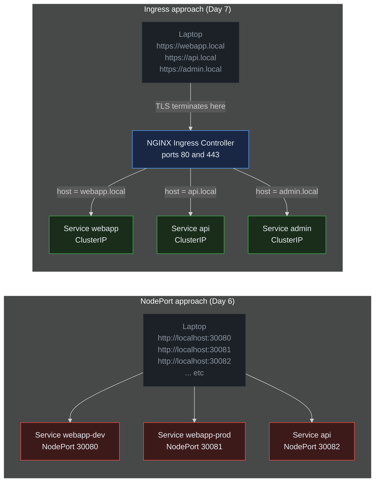
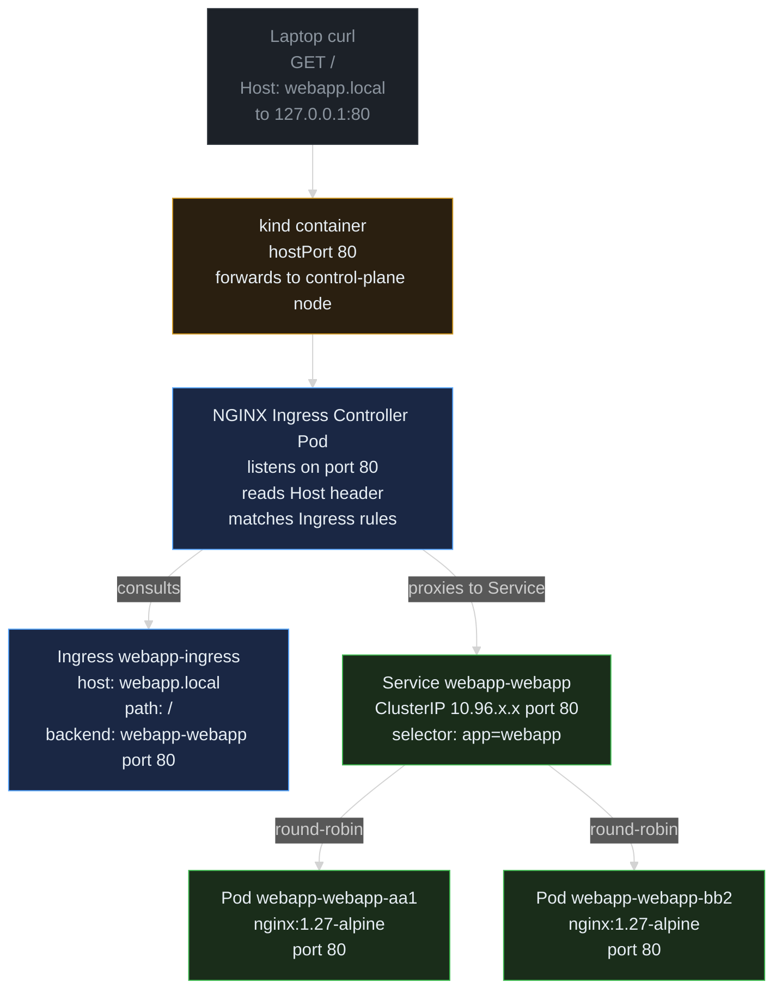
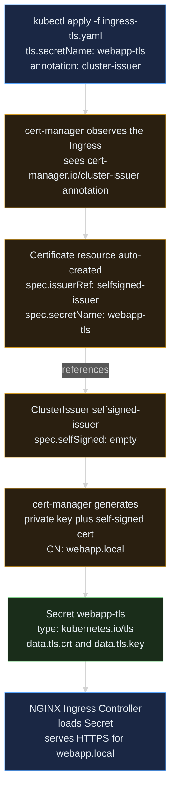

> **30 Days of DevOps** — Day 7 of 30. [← Day 6: Helm](/articles/2026/05/17/day-06-helm-package-manager/)

In [Day 6](/articles/2026/05/17/day-06-helm-package-manager/) you packaged the webapp as a Helm chart and exposed it on `localhost:30080` via a NodePort. NodePort works for local development, but it has two production-breaking problems:

1. It only speaks **HTTP** on a raw port — no TLS, no friendly hostnames.
2. Every service needs its own unique port number. With ten services you have ten ports to remember and document.

The production answer is an **Ingress**: a single HTTPS entry point per cluster, routing requests to the right service by **hostname** and **path**. Ingress is also where TLS terminates — your apps stay HTTP-only inside the cluster, while the Ingress handles certificates at the edge.

In this article you will install the **NGINX Ingress Controller** and **cert-manager**, route `webapp.local` to your Helm release, and serve it over HTTPS with a self-signed certificate issued automatically.

## What you will build

By the end of this article you will have:

- A kind cluster with **ports 80 and 443** mapped from your laptop into the cluster
- The **NGINX Ingress Controller** running in the cluster, listening on those ports
- The webapp from Day 6 reinstalled as **ClusterIP** (no more NodePort)
- An **Ingress resource** routing `webapp.local` → the webapp Service
- **cert-manager** installed with a self-signed **ClusterIssuer**
- An **HTTPS endpoint** at `https://webapp.local` with an auto-issued TLS certificate

---

## Prerequisites

This article continues from Day 6. The Day 6 cluster used NodePort 30080 and a separate 30081 for the prod release — neither will work for Ingress. We will recreate the cluster from scratch with the right port mappings.

| Tool | Minimum version | Check |
|---|---|---|
| Docker | 24.x | `docker --version` |
| kubectl | 1.29 | `kubectl version --client` |
| kind | 0.23 | `kind --version` |
| Helm | 3.14 | `helm version --short` |

If you still have the Day 6 cluster running, delete it:

```bash
kind delete cluster --name devops-cluster
```

Expected output:

```text
Deleting cluster "devops-cluster" ...
```

---

## Why Ingress?

Look at how NodePort scales (or fails to) compared to Ingress:



**Reading this diagram:**

The **"NodePort approach"** subgraph (red Service boxes) is what you had at the end of Day 6: every service occupies its own unique port number on the host (`30080`, `30081`, `30082`, ...), and the laptop must remember each one. There is no hostname routing, no TLS, and no central place to control traffic policy. Each service is exposed independently and the operator has to track which port belongs to which app. Adding a tenth service means picking yet another port and updating documentation.

The **"Ingress approach"** subgraph (green Service boxes) is what you will build today. A single **NGINX Ingress Controller** (blue) listens on the standard ports 80 and 443, and the laptop visits **hostnames** like `https://webapp.local` and `https://api.local`. The controller reads each request's `Host:` header, matches it against Ingress rules, and forwards to the right backing Service. TLS terminates at the controller — so your application Pods continue serving plain HTTP internally while clients see HTTPS. Adding a tenth service costs nothing on the port budget: you just add a new hostname rule.

The key insight: NodePort exposes services **one port at a time**. Ingress exposes them **one cluster at a time**, multiplexing many hostnames onto two well-known ports. Production clusters always do the latter.

---

## Part 1 — Recreate the cluster with ports 80 and 443

The NGINX Ingress Controller for kind needs three things from the cluster:

1. **Port 80 and 443** mapped from the host into the control-plane node, so requests from the laptop reach the controller.
2. A **label** on the control-plane node (`ingress-ready=true`) so the controller knows which node it can schedule on.
3. The control-plane **tainted node** must allow scheduling — the standard kind manifest handles this automatically once the label exists.

Create the project directory and cluster config:

```bash
mkdir -p ~/30-days-devops/day-07 && cd ~/30-days-devops/day-07
```

```bash
cat > kind-cluster.yaml << 'EOF'
kind: Cluster
apiVersion: kind.x-k8s.io/v1alpha4
nodes:
  - role: control-plane
    kubeadmConfigPatches:
      - |
        kind: InitConfiguration
        nodeRegistration:
          kubeletExtraArgs:
            node-labels: "ingress-ready=true"
    extraPortMappings:
      - containerPort: 80
        hostPort: 80
        protocol: TCP
      - containerPort: 443
        hostPort: 443
        protocol: TCP
  - role: worker
  - role: worker
EOF
```

Two changes from Day 5/6's cluster config:
- `kubeadmConfigPatches` labels the control-plane node with `ingress-ready=true`. The kind NGINX manifest uses this as a `nodeSelector`.
- `extraPortMappings` now maps host ports 80 and 443 into the cluster, replacing the old 30080/30081 mappings.

Create the cluster:

```bash
kind create cluster --name devops-cluster --config kind-cluster.yaml
```

Expected output:

```text
Creating cluster "devops-cluster" ...
 ✓ Ensuring node image (kindest/node:v1.29.2)
 ✓ Preparing nodes
 ✓ Writing configuration
 ✓ Starting control-plane
 ✓ Installing CNI
 ✓ Installing StorageClass
 ✓ Joining worker nodes
Set kubectl context to "kind-devops-cluster"
```

Verify the control-plane node has the label:

```bash
kubectl get nodes --show-labels | grep ingress-ready
```

Expected output:

```text
devops-cluster-control-plane   Ready   control-plane   90s   v1.29.2   ...,ingress-ready=true,...
```

---

## Part 2 — Install the NGINX Ingress Controller

The Kubernetes project publishes a kind-tailored manifest for NGINX Ingress that wires up `hostPort: 80/443` and uses the `ingress-ready` nodeSelector. Apply it:

```bash
kubectl apply -f https://raw.githubusercontent.com/kubernetes/ingress-nginx/controller-v1.11.2/deploy/static/provider/kind/deploy.yaml
```

Expected output (condensed):

```text
namespace/ingress-nginx created
serviceaccount/ingress-nginx created
configmap/ingress-nginx-controller created
clusterrole.rbac.authorization.k8s.io/ingress-nginx created
clusterrolebinding.rbac.authorization.k8s.io/ingress-nginx created
role.rbac.authorization.k8s.io/ingress-nginx created
rolebinding.rbac.authorization.k8s.io/ingress-nginx created
service/ingress-nginx-controller-admission created
service/ingress-nginx-controller created
deployment.apps/ingress-nginx-controller created
ingressclass.networking.k8s.io/nginx created
validatingwebhookconfiguration.admissionregistration.k8s.io/ingress-nginx-admission created
serviceaccount/ingress-nginx-admission created
clusterrole.rbac.authorization.k8s.io/ingress-nginx-admission created
clusterrolebinding.rbac.authorization.k8s.io/ingress-nginx-admission created
role.rbac.authorization.k8s.io/ingress-nginx-admission created
rolebinding.rbac.authorization.k8s.io/ingress-nginx-admission created
job.batch/ingress-nginx-admission-create created
job.batch/ingress-nginx-admission-patch created
```

The controller needs about 60 seconds to come up. Wait for it to be ready:

```bash
kubectl wait --namespace ingress-nginx \
  --for=condition=ready pod \
  --selector=app.kubernetes.io/component=controller \
  --timeout=120s
```

Expected output:

```text
pod/ingress-nginx-controller-7d4c5f6b9-xk2vp condition met
```

Verify the controller is listening on the right ports:

```bash
kubectl get svc -n ingress-nginx ingress-nginx-controller
```

Expected output:

```text
NAME                       TYPE           CLUSTER-IP      EXTERNAL-IP   PORT(S)                      AGE
ingress-nginx-controller   LoadBalancer   10.96.211.117   <pending>     80:32080/TCP,443:32443/TCP   90s
```

The Service is `LoadBalancer` (its `EXTERNAL-IP` stays `<pending>` forever in kind because there is no cloud load balancer to provision), but that doesn't matter for our setup — the kind `extraPortMappings` forward host port 80 → control-plane container port 80, and the NGINX controller Pod binds directly to the node's port 80 via `hostPort`. From the laptop you reach it at `localhost:80` and `localhost:443`.

Sanity check with a raw `curl` (no Ingress rule yet, expect a 404):

```bash
curl -sI http://localhost
```

Expected output:

```text
HTTP/1.1 404 Not Found
Date: Mon, 18 May 2026 09:00:00 GMT
Content-Type: text/html
Server: nginx
```

A 404 from `Server: nginx` confirms the controller is reachable. It returned 404 because no Ingress rule yet matches `Host: localhost`.

---

## Part 3 — Reinstall the webapp as ClusterIP

Day 6's `values.yaml` used `service.type: NodePort`. For Ingress, we want `ClusterIP` so the Service is only reachable inside the cluster — the Ingress controller is the only thing that should reach it. Create a values file that overrides the service type:

```bash
cat > values-ingress.yaml << 'EOF'
replicaCount: 2

image:
  tag: "1.27-alpine"

service:
  type: ClusterIP
  port: 80
  targetPort: 80

resources:
  requests:
    cpu: 25m
    memory: 32Mi
  limits:
    cpu: 50m
    memory: 64Mi
EOF
```

Notice there is no `nodePort` field — `ClusterIP` services do not need one, and Day 6's `service.yaml` template skips the `nodePort` line whenever the service type is not `NodePort` (the `if and` block from Day 6).

Install the chart from Day 6:

```bash
helm install webapp ~/30-days-devops/day-06/webapp -f values-ingress.yaml
```

Expected output:

```text
NAME: webapp
LAST DEPLOYED: Mon May 18 09:05:12 2026
NAMESPACE: default
STATUS: deployed
REVISION: 1
NOTES:
Release webapp installed in namespace default.

To check status:
  kubectl get pods -l "app.kubernetes.io/instance=webapp"
```

(The NOTES block does not print the NodePort instructions this time — the `{{- if eq .Values.service.type "NodePort" }}` conditional in the chart's `NOTES.txt` from Day 6 evaluates false.)

Verify the Service is ClusterIP and the pods are running:

```bash
kubectl get svc,pods -l app.kubernetes.io/instance=webapp
```

Expected output:

```text
NAME                   TYPE        CLUSTER-IP      EXTERNAL-IP   PORT(S)   AGE
service/webapp-webapp  ClusterIP   10.96.85.42     <none>        80/TCP    30s

NAME                                READY   STATUS    RESTARTS   AGE
pod/webapp-webapp-6c9d8f7b5-aa1     1/1     Running   0          30s
pod/webapp-webapp-6c9d8f7b5-bb2     1/1     Running   0          30s
```

The Service name is `webapp-webapp` — `<release name>-<chart name>` per Helm's `_helpers.tpl` from Day 6. We will reference this name in the Ingress resource next.

---

## Part 4 — Write the Ingress resource

An Ingress is just another Kubernetes manifest. It declares:
- Which **IngressClass** to use (we use `nginx` for the NGINX controller)
- One or more **rules**, each binding a `host:` to a path → backend Service mapping

Write the manifest:

```bash
cat > ingress.yaml << 'EOF'
apiVersion: networking.k8s.io/v1
kind: Ingress
metadata:
  name: webapp-ingress
spec:
  ingressClassName: nginx
  rules:
    - host: webapp.local
      http:
        paths:
          - path: /
            pathType: Prefix
            backend:
              service:
                name: webapp-webapp
                port:
                  number: 80
EOF
```

Apply it:

```bash
kubectl apply -f ingress.yaml
```

Expected output:

```text
ingress.networking.k8s.io/webapp-ingress created
```

Inspect what was created:

```bash
kubectl get ingress webapp-ingress
```

Expected output:

```text
NAME             CLASS   HOSTS          ADDRESS     PORTS   AGE
webapp-ingress   nginx   webapp.local   localhost   80      10s
```

`ADDRESS: localhost` means the NGINX controller has accepted the rule and is ready to route `webapp.local` traffic.

### Test HTTP routing

Your laptop has no DNS entry for `webapp.local`. Rather than editing `/etc/hosts`, use `curl --resolve` to spoof the hostname for this one request:

```bash
curl --resolve webapp.local:80:127.0.0.1 -s http://webapp.local/ | grep -o '<title>.*</title>'
```

Expected output:

```text
<title>Welcome to nginx!</title>
```

The request flow:
1. `curl` sends `GET / HTTP/1.1` with header `Host: webapp.local` to `127.0.0.1:80`.
2. kind's `extraPortMappings` forwards host port 80 to the control-plane container's port 80.
3. The NGINX Ingress Controller (which has `hostPort: 80`) receives it, reads `Host: webapp.local`, looks up the matching rule, and proxies to the `webapp-webapp` Service.
4. The Service load-balances to one of the two webapp pods, which returns the nginx welcome page.

---

## Part 5 — Anatomy of an Ingress request



**Reading this diagram:**

Read top to bottom. The request begins at the top with **`curl` on your laptop** (muted grey) sending `GET /` to `127.0.0.1:80` with the header `Host: webapp.local`. The hostname is purely informational at this stage — `curl --resolve` already short-circuited DNS by sending the packet to `127.0.0.1`.

The packet next reaches the **kind container** (amber) — the Docker container that hosts the control-plane node. Because `kind-cluster.yaml` declared `hostPort: 80`, Docker maps the laptop's port 80 into the container, and the container forwards it onto the control-plane node's port 80.

There, the **NGINX Ingress Controller Pod** (blue) is listening on the node's port 80 via `hostPort` (set by the kind-tailored manifest from Part 2). The controller reads the `Host:` header, scans its in-memory copy of every Ingress resource, and finds the **rule** (also blue) that matches `webapp.local` and path `/`. The rule names a backend Service: `webapp-webapp` on port 80.

The controller then **proxies** the request to the **`webapp-webapp` Service** (green), which is a `ClusterIP` Service — invisible from outside the cluster, but reachable internally on its virtual IP. The Service load-balances across the two **webapp Pods** (also green), each running `nginx:1.27-alpine` on container port 80. One of them returns the nginx welcome page.

The key insight: the Ingress Controller is the only thing in the cluster exposed to the outside world. The application Service stays `ClusterIP`. Adding more services means more Ingress rules, not more open ports.

---

## Part 6 — Install cert-manager

cert-manager is a Kubernetes operator that watches `Certificate` resources and creates the corresponding TLS Secrets, either by talking to an ACME server (Let's Encrypt), an internal CA, or a self-signed issuer. For local development the self-signed issuer is enough.

Install it via the official Helm chart:

```bash
helm repo add jetstack https://charts.jetstack.io
helm repo update
```

Expected output:

```text
"jetstack" has been added to your repositories
Hang tight while we grab the latest from your chart repositories...
...Successfully got an update from the "jetstack" chart repository
Update Complete.
```

Install cert-manager with its CRDs:

```bash
helm install cert-manager jetstack/cert-manager \
  --namespace cert-manager --create-namespace \
  --version v1.14.5 \
  --set installCRDs=true
```

> **Note for newer cert-manager versions:** In cert-manager v1.15+ the flag was renamed to `--set crds.enabled=true`. If you bump the chart version, update this flag accordingly.

Expected output:

```text
NAME: cert-manager
LAST DEPLOYED: Mon May 18 09:15:30 2026
NAMESPACE: cert-manager
STATUS: deployed
REVISION: 1
NOTES:
cert-manager v1.14.5 has been deployed successfully!
```

Wait for all three cert-manager pods (controller, webhook, cainjector):

```bash
kubectl wait --namespace cert-manager \
  --for=condition=ready pod \
  --selector=app.kubernetes.io/instance=cert-manager \
  --timeout=120s
```

Expected output:

```text
pod/cert-manager-5d8b9f7c4-aa1xy condition met
pod/cert-manager-cainjector-7b9d4f8c6-bb2zw condition met
pod/cert-manager-webhook-8c4d5f7b9-cc3yt condition met
```

Verify the CRDs are installed:

```bash
kubectl get crd | grep cert-manager
```

Expected output:

```text
certificaterequests.cert-manager.io   2026-05-18T09:15:32Z
certificates.cert-manager.io          2026-05-18T09:15:32Z
challenges.acme.cert-manager.io       2026-05-18T09:15:33Z
clusterissuers.cert-manager.io        2026-05-18T09:15:33Z
issuers.cert-manager.io               2026-05-18T09:15:33Z
orders.acme.cert-manager.io           2026-05-18T09:15:33Z
```

---

## Part 7 — Create a self-signed ClusterIssuer

An **Issuer** is namespace-scoped; a **ClusterIssuer** is cluster-wide. We use the cluster-wide variant so any namespace can request certificates from it.

The simplest issuer is `selfSigned: {}` — it generates a brand-new self-signed CA on every Certificate request. The resulting cert is not trusted by browsers (you will get the "not secure" warning), but it proves end-to-end TLS works and is a useful staging step before swapping in a real CA like Let's Encrypt.

```bash
cat > cluster-issuer.yaml << 'EOF'
apiVersion: cert-manager.io/v1
kind: ClusterIssuer
metadata:
  name: selfsigned-issuer
spec:
  selfSigned: {}
EOF
```

Apply it:

```bash
kubectl apply -f cluster-issuer.yaml
```

Expected output:

```text
clusterissuer.cert-manager.io/selfsigned-issuer created
```

Verify the ClusterIssuer is ready:

```bash
kubectl get clusterissuer
```

Expected output:

```text
NAME                READY   AGE
selfsigned-issuer   True    10s
```

`READY: True` means cert-manager has accepted the resource. The issuer does nothing yet — it sits idle until a Certificate resource references it.

---

## Part 8 — Add TLS to the Ingress

Update the Ingress with a `tls:` section and a cert-manager annotation. The annotation tells cert-manager to auto-create a Certificate resource for this Ingress.

```bash
cat > ingress-tls.yaml << 'EOF'
apiVersion: networking.k8s.io/v1
kind: Ingress
metadata:
  name: webapp-ingress
  annotations:
    cert-manager.io/cluster-issuer: selfsigned-issuer
spec:
  ingressClassName: nginx
  tls:
    - hosts:
        - webapp.local
      secretName: webapp-tls
  rules:
    - host: webapp.local
      http:
        paths:
          - path: /
            pathType: Prefix
            backend:
              service:
                name: webapp-webapp
                port:
                  number: 80
EOF
```

Apply the update:

```bash
kubectl apply -f ingress-tls.yaml
```

Expected output:

```text
ingress.networking.k8s.io/webapp-ingress configured
```

cert-manager now sees the annotation and the `tls.secretName: webapp-tls`. It creates a `Certificate` resource, asks the `selfsigned-issuer` to fulfil it, and stores the resulting cert + key in a Secret named `webapp-tls`.

Watch the Certificate appear:

```bash
kubectl get certificate
```

Expected output (after ~10 seconds):

```text
NAME          READY   SECRET        AGE
webapp-tls    True    webapp-tls    12s
```

`READY: True` means the certificate has been issued and the Secret is populated.

Inspect the Secret:

```bash
kubectl get secret webapp-tls
```

Expected output:

```text
NAME         TYPE                DATA   AGE
webapp-tls   kubernetes.io/tls   2      30s
```

`DATA: 2` because a TLS secret holds two keys: `tls.crt` and `tls.key`. The NGINX Ingress Controller automatically picks up Secrets named in an Ingress's `tls:` block and starts serving HTTPS for that host.

---

## Part 9 — Test HTTPS

```bash
curl --resolve webapp.local:443:127.0.0.1 -k -s https://webapp.local/ | grep -o '<title>.*</title>'
```

Expected output:

```text
<title>Welcome to nginx!</title>
```

The `-k` (or `--insecure`) flag tells `curl` to skip certificate validation — necessary because the self-signed cert is not in any trust store. Inspect the cert anyway to confirm it is real:

```bash
curl --resolve webapp.local:443:127.0.0.1 -kv https://webapp.local/ 2>&1 | grep -E "subject:|issuer:|SSL connection"
```

Expected output:

```text
* SSL connection using TLSv1.3 / TLS_AES_256_GCM_SHA384
*  subject: CN=webapp.local
*  issuer: CN=webapp.local
```

`subject` and `issuer` are both `CN=webapp.local` because the ClusterIssuer is self-signed — it signs the cert with itself. TLS 1.3 is negotiated; the cipher suite is modern. End-to-end HTTPS works.

### How cert-manager produced that certificate



**Reading this diagram:**

Read top to bottom. The flow has three colour groups: **blue** for components in your data plane that you interact with (the `kubectl apply` you run at the top, and the NGINX controller that ultimately serves traffic at the bottom), **amber** for everything cert-manager does automatically on your behalf in the middle, and **green** for the TLS Secret that bridges the cert-manager side and the NGINX side.

You begin at the top with **`kubectl apply -f ingress-tls.yaml`** (blue), which adds two things to the Ingress: the `tls:` block naming `webapp-tls` as the Secret, and the `cert-manager.io/cluster-issuer: selfsigned-issuer` annotation.

**cert-manager** (amber) is watching all Ingress resources. The moment it sees the annotation, it **auto-creates a Certificate resource** describing what it needs to produce: a cert for hostname `webapp.local`, signed by the `selfsigned-issuer` ClusterIssuer, stored in a Secret named `webapp-tls`. The Certificate **references** the **ClusterIssuer** (amber), which already exists from Part 7. cert-manager then **generates a private key and a self-signed certificate** with `CN: webapp.local`.

The result is written as a **TLS Secret** (green) with two data keys — `tls.crt` (the certificate) and `tls.key` (the private key) — and a Secret type of `kubernetes.io/tls`.

Finally, the **NGINX Ingress Controller** (blue) is watching all Secrets referenced by Ingress `tls:` blocks. As soon as `webapp-tls` is populated, it reloads its NGINX config and starts terminating HTTPS for `webapp.local`.

The key insight: you never touched OpenSSL, never base64-encoded a `.pem` file, never edited a Secret by hand. The Ingress annotation triggers an automatic chain that produces a working certificate. In production the same chain swaps `selfSigned` for an ACME issuer (Let's Encrypt) and you get a publicly trusted cert with zero workflow change.

---

## Cleanup

Uninstall everything in reverse install order:

```bash
helm uninstall webapp
kubectl delete -f ingress-tls.yaml
kubectl delete -f cluster-issuer.yaml
helm uninstall cert-manager -n cert-manager
kubectl delete -f https://raw.githubusercontent.com/kubernetes/ingress-nginx/controller-v1.11.2/deploy/static/provider/kind/deploy.yaml
```

Or just delete the whole cluster:

```bash
kind delete cluster --name devops-cluster
```

Expected output:

```text
Deleting cluster "devops-cluster" ...
```

---

## Common errors

### Error 1 — Ingress controller never becomes Ready

```text
error: timed out waiting for the condition on pods/ingress-nginx-controller-xxxxx
```

**Cause:** Most often the control-plane node is missing the `ingress-ready=true` label, so the controller pod stays Pending because no node matches its nodeSelector.

**Fix:**

```bash
# Check node labels
kubectl get nodes --show-labels

# If the label is missing, you skipped the kubeadmConfigPatches block.
# Recreate the cluster with the kind-cluster.yaml from Part 1.
kind delete cluster --name devops-cluster
kind create cluster --name devops-cluster --config kind-cluster.yaml

# Then reapply the controller manifest
kubectl apply -f https://raw.githubusercontent.com/kubernetes/ingress-nginx/controller-v1.11.2/deploy/static/provider/kind/deploy.yaml
```

---

### Error 2 — 404 Not Found on the correct hostname

```text
HTTP/1.1 404 Not Found
Server: nginx
```

**Cause:** The Ingress rule's `backend.service.name` does not match the actual Service name. Helm names Services `<release-name>-<chart-name>`, so a release called `webapp` of chart `webapp` produces Service `webapp-webapp`.

**Fix:**

```bash
# Confirm the Service name
kubectl get svc

# Edit ingress.yaml so backend.service.name matches exactly,
# then re-apply
kubectl apply -f ingress.yaml
```

---

### Error 3 — Certificate stuck not ready

```text
NAME          READY   SECRET        AGE
webapp-tls    False   webapp-tls    2m
```

**Cause:** Either the ClusterIssuer is not ready, or the Certificate resource is misconfigured (wrong issuer name, wrong hostname).

**Fix:**

```bash
# Drill into the Certificate's status
kubectl describe certificate webapp-tls

# Check the underlying CertificateRequest
kubectl get certificaterequest
kubectl describe certificaterequest <name>

# Most common cause: typo in cert-manager.io/cluster-issuer annotation.
# It must exactly match the ClusterIssuer's metadata.name (selfsigned-issuer).
```

---

### Error 4 — curl returns Connection refused on port 80

```text
curl: (7) Failed to connect to webapp.local port 80: Connection refused
```

**Cause:** kind is not forwarding host port 80 into the cluster, usually because `extraPortMappings` was omitted or another local service is already bound to port 80.

**Fix:**

```bash
# Check what's listening on port 80
sudo lsof -i :80

# If Apache/nginx is running locally, stop it
sudo systemctl stop apache2     # Linux
brew services stop nginx        # macOS

# Then verify the kind cluster has the port mapping
docker ps --filter "name=devops-cluster" --format "table {{.Names}}\t{{.Ports}}"
# Should show 0.0.0.0:80->80/tcp and 0.0.0.0:443->443/tcp
```

---

### Error 5 — cert-manager webhook errors during install

```text
Error: INSTALLATION FAILED: Internal error occurred:
failed calling webhook "webhook.cert-manager.io":
failed to call webhook: Post ... no endpoints available
```

**Cause:** cert-manager's validating admission webhook isn't ready yet, but a Certificate or Issuer resource was applied immediately after installation.

**Fix:**

```bash
# Wait for the webhook to be ready before creating any cert-manager resources
kubectl wait --namespace cert-manager \
  --for=condition=ready pod \
  --selector=app.kubernetes.io/component=webhook \
  --timeout=120s

# Then retry the apply
kubectl apply -f cluster-issuer.yaml
```

---

### Error 6 — Browser shows ERR_CERT_AUTHORITY_INVALID

```text
NET::ERR_CERT_AUTHORITY_INVALID
Your connection is not private
```

**Cause:** A self-signed certificate is not signed by any CA your browser trusts. This is expected for the `selfSigned` ClusterIssuer — it is intentionally untrusted, useful only for proving the TLS pipeline works.

**Fix:**

For local dev, this is fine — click through the warning or use `curl -k`. For a real certificate, swap the ClusterIssuer for an ACME issuer (Let's Encrypt). A minimal example:

```yaml
apiVersion: cert-manager.io/v1
kind: ClusterIssuer
metadata:
  name: letsencrypt-staging
spec:
  acme:
    server: https://acme-staging-v02.api.letsencrypt.org/directory
    email: you@example.com
    privateKeySecretRef:
      name: letsencrypt-staging-key
    solvers:
      - http01:
          ingress:
            class: nginx
```

Then point the Ingress annotation at this issuer. Let's Encrypt staging is rate-limit-friendly and great for testing; switch to `https://acme-v02.api.letsencrypt.org/directory` for production.

---

## What you built

In this article you:

- Recreated the kind cluster with **host ports 80 and 443** and the `ingress-ready=true` node label
- Installed the **NGINX Ingress Controller** using the kind-tailored deploy manifest
- Reinstalled the Day 6 chart with a `values-ingress.yaml` overriding the Service to **ClusterIP**
- Wrote an Ingress routing **`webapp.local`** to the webapp Service via hostname matching
- Installed **cert-manager** via its Helm chart and created a **self-signed ClusterIssuer**
- Added a `tls:` block + cert-manager annotation to the Ingress; watched cert-manager auto-issue a Secret and NGINX automatically pick it up to serve **HTTPS**
- Verified end-to-end with `curl --resolve` over both HTTP and HTTPS

Your project layout:

```text
~/30-days-devops/day-07/
├── kind-cluster.yaml       # 3-node cluster with ingress-ready label and 80/443 mappings
├── values-ingress.yaml     # Override Day 6 chart to ClusterIP (no nodePort)
├── ingress.yaml            # HTTP-only Ingress (Part 4)
├── ingress-tls.yaml        # HTTPS Ingress with cert-manager annotation (Part 8)
└── cluster-issuer.yaml     # Self-signed ClusterIssuer (Part 7)
```

---

## Day 8 — Observability: Prometheus and Grafana via kube-prometheus-stack

In Day 8 we instrument the cluster. You will:

- Install the **kube-prometheus-stack** Helm chart in one command (Prometheus, Grafana, node-exporter, kube-state-metrics, Alertmanager)
- Expose Grafana through the same Ingress controller from today, with a `grafana.local` hostname
- Find your webapp Pods automatically appearing in Prometheus targets via the **ServiceMonitor** CRD
- Build a Grafana dashboard showing request rate, error rate, and pod CPU/memory
- Wire a basic alert rule that fires when no pods are Ready

[Day 8 coming soon →]
